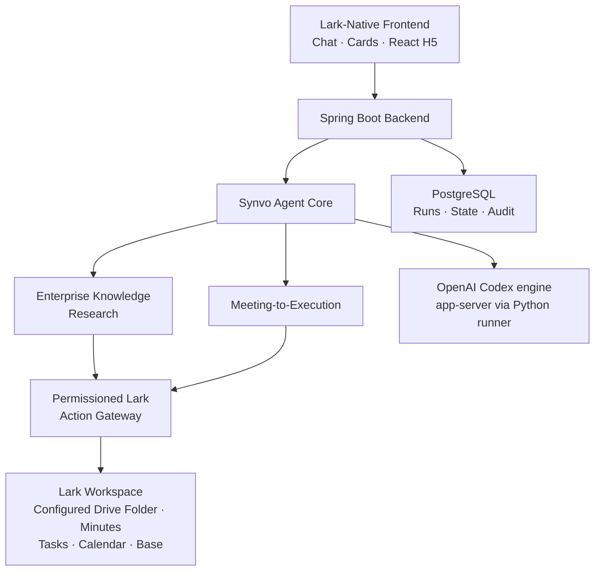
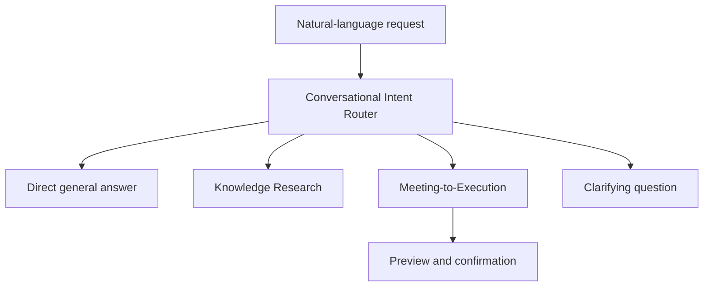

# Synvo AI Assistant — Project Overview

## Purpose

Synvo is a Lark-native AI assistant that helps users find trustworthy information in their Lark workspace and convert meetings into concrete execution.

The MVP is designed around a simple product idea:

> Users communicate naturally with one AI assistant inside Lark. Synvo decides when to answer directly, when to retrieve permissioned Lark knowledge, and when to run a controlled workflow.

This document is the high-level product and engineering reference for the project. It exists to keep implementation aligned with the MVP goals, maintain a clear system boundary, and prevent unnecessary architectural complexity.

## Main Goals

### 1. Deliver a natural conversational experience

Natural language is the primary interface to Synvo. Users should not need to select tools, learn commands, or understand the underlying workflows.

Powered by the OpenAI Codex agent engine, Synvo should understand the user's intent and conversational context, then choose the appropriate behavior:

- Answer a general question directly.
- Retrieve relevant information from the configured Lark knowledge source.
- Run Enterprise Knowledge Research.
- Run Meeting-to-Execution.
- Ask a concise clarifying question when the request is ambiguous.
- Request confirmation before performing a Lark write operation.

The experience should feel like one continuous conversation, even though the backend uses structured routing, tools, and workflows.

### 2. Make enterprise knowledge accessible

For the MVP, Enterprise Knowledge Research is intentionally limited to one configured folder in Victor's Lark Drive.

Synvo should search, retrieve, and synthesize supported resources within that folder, including Lark Docs, Sheets, Slides, Base content, and downloadable files where supported. It should return a direct answer with citations and links to the original Lark resources.

Synvo must not treat everything Victor can access as part of the knowledge base. The configured folder is the explicit product boundary.

### 3. Convert meetings into execution

Synvo should transform a relevant Lark meeting into a reviewable execution plan containing:

- Decisions
- Explicit commitments
- Proposed action items
- Owners and due dates
- Follow-up meeting options
- Proposed Lark Tasks, Calendar events, and Base updates

The user reviews and edits the plan before any action is created. Model reasoning proposes the plan; deterministic backend services validate and execute the confirmed actions.

### 4. Feel native to Lark

Lark is the operating surface and permissioned action environment for the product.

- **Lark Chat** starts requests and supports follow-up conversation.
- **Lark Cards** communicate progress, summarize results, and request confirmation.
- **React H5** presents detailed research and editable execution plans.
- **Lark Open Platform APIs** provide permissioned access to knowledge and actions.

Users should not feel that they are leaving Lark to operate a separate AI system.

### 5. Be trustworthy and permission-aware

Synvo must respect the permissions of the Lark user and the configured application scopes. AI reasoning must not bypass resource access, confirmation, or audit controls.

Every Lark operation must use the appropriate access token, declare its required scopes, and pass through a controlled action boundary. Write operations require explicit confirmation when they affect user or enterprise data.

### 6. Preserve simplicity and maintainability

The MVP should solve the two selected workflows well without prematurely becoming a general-purpose agent platform.

We value:

- Clear module boundaries
- Explicit workflows
- Deterministic execution for critical operations
- A small number of deployable components
- Replaceable model and framework integrations
- Code that can be understood and changed without navigating unnecessary abstraction

Scalability should come from clear boundaries and stateless application design, not from starting with a distributed architecture.

## MVP Scope

The MVP includes two agentic workflows.

### Enterprise Knowledge Research

The user asks a question in natural language. Synvo searches only the configured folder in Victor's Lark Drive, retrieves relevant resources, reconciles the evidence, and produces a cited answer.

Typical request:

> Assess Project Atlas launch readiness using the launch plan, risk tracker, and related project material in my configured Drive folder. Highlight blockers and cite the sources.

The result is summarized in Lark Chat and can be explored in greater detail in the H5 application.

### Meeting-to-Execution

The user asks Synvo to turn a Lark meeting into an execution plan. Synvo reads the relevant meeting material, extracts decisions and commitments, and proposes tasks, owners, dates, and follow-up actions.

Typical request:

> Turn yesterday's Project Atlas launch review into an execution plan. Create tasks only after I review them.

The plan is reviewed and edited in the H5 application. Synvo executes only the actions explicitly confirmed by the user.

## Technology Choices

| Layer | Technology | Role |
|---|---|---|
| Native interface | Lark Chat and Lark Cards | Conversation, progress, results, and confirmations |
| H5 frontend | React, TypeScript, Vite, Tailwind CSS | Research views and editable execution plans |
| Backend | Java and Spring Boot | APIs, security, orchestration, integrations, and persistence |
| Lark integration | Lark OpenAPI Java SDK | Lark events, messages, resources, and actions |
| Agent foundation | Synvo Agent Core | Conversation orchestration, lifecycle, and deterministic policy around the engine |
| Agent engine | OpenAI Codex (app-server + official Python SDK) | Agentic reasoning, response generation, and approval-gated execution |
| Engine runner | One Python sidecar service | Hosts the Codex app-server behind a Synvo-owned engine port and translates lifecycle events |
| Persistence | PostgreSQL | Workflow state, source configuration, confirmations, idempotency, and audit |
| Client updates | REST and Server-Sent Events | Commands and live workflow progress |

Codex protocol and SDK details must remain inside the engine runner and its backend adapter, behind Synvo-owned interfaces. The application architecture must not depend directly on Codex specifics, and replacing the engine must not require changes outside that boundary. Phase 3 ("Codex in Lark") replaces the Phase 2 NVIDIA Nemotron gateway entirely; until that phase completes, the Nemotron configuration remains in the code.

## High-Level Architecture

The architectural rule is:

> The Agent Core decides what should happen; the Action Gateway controls what is allowed to happen.

## System Design

### Lark-native frontend

The frontend is one experience across three Lark surfaces:

- Chat provides the conversational entry point.
- Cards provide concise state, results, and confirmations.
- The React H5 application handles interactions that are too complex for chat, such as source comparison and execution-plan editing.

### Spring Boot modular monolith

The backend is a modular monolith deployed as one Spring Boot application. It owns:

- Lark events and callbacks
- H5 APIs and authentication
- Agent and workflow execution
- Lark tool integration
- Token and permission handling
- Workflow persistence
- Confirmation and idempotency state
- Audit records

Modules are separated in code, not deployed as independent services. The one
exception is the Codex engine runner: a single Python sidecar that hosts the
Codex app-server, existing only because the official Codex SDK ships in
TypeScript and Python. It holds no product logic and is reachable solely
through the backend's engine port.

### Synvo Agent Core

The Agent Core is the application-specific intelligence and orchestration layer. Its responsibilities are limited to:

- Understanding the request and conversation context
- Selecting direct response, clarification, research, or meeting workflow
- Calling the agent engine through a provider abstraction
- Selecting from explicitly registered tools
- Managing workflow state
- Publishing progress and results

The model may propose a route or tool call, but deterministic application policy validates what is permitted.

### Permissioned Lark Action Gateway

Every Lark read or write passes through the Action Gateway. It is responsible for:

- Selecting the correct user or tenant token
- Checking required scopes
- Enforcing the configured Drive-folder boundary
- Verifying resource access
- Applying risk and confirmation policies
- Preventing duplicate writes
- Recording auditable operations

The model never receives Lark credentials and never constructs unrestricted API calls.

### Data and retrieval

PostgreSQL is the only application database required for the MVP. It stores operational state and references, not an uncontrolled copy of the enterprise workspace.

Enterprise Knowledge Research begins with live Lark search and on-demand retrieval. A separate vector database and enterprise-wide ingestion pipeline are not part of the MVP. Semantic indexing may be evaluated later if evidence shows that live retrieval is insufficient.

## Natural-Language Routing

A direct answer should not call Lark tools unnecessarily. A question about internal knowledge should use permissioned retrieval and citations. A request to act on a meeting should enter the explicit workflow. An ambiguous or consequential request should result in clarification or confirmation rather than an assumption.

Natural language controls the experience; explicit policies control execution.

## Simplicity Principles

1. **Build two bounded workflows, not a universal agent.**
2. **Prefer explicit Java workflow code over premature framework abstraction.**
3. **Keep model reasoning separate from permissioned execution.**
4. **Use deterministic services for authorization, writes, idempotency, and audit.**
5. **Start with live retrieval from one configured Drive folder.**
6. **Use PostgreSQL before introducing additional data infrastructure.**
7. **Keep one Spring Boot backend until operational evidence justifies service separation.**
8. **Adopt third-party agent components only for a current, demonstrated requirement.**
9. **Add abstractions when a second real implementation requires them, not in anticipation of one.**
10. **Prefer observable, testable workflow behavior over opaque autonomy.**

## MVP Non-Goals

The MVP does not include:

- Enterprise-wide knowledge ingestion
- Search across every resource Victor can access
- A separate vector database
- A multi-agent system or agent swarm
- A generic agent-building platform
- A visual workflow designer
- Microservices or event-driven infrastructure for its own sake
- Automatic task creation without review
- Autonomous changes to Lark permissions
- Destructive document, Drive, or Base operations
- Unsupervised monitoring of all Lark conversations
- Autonomous approval decisions

These items require separate product evidence and architectural justification before entering scope.

## Success Criteria

The MVP is successful when:

- Users can interact with Synvo naturally without learning commands or workflows.
- Synvo reliably distinguishes general questions from Lark-grounded requests and actionable workflow requests.
- Knowledge answers are grounded in the configured Drive folder and include usable citations.
- Meeting outputs accurately separate decisions, explicit commitments, and inferred suggestions.
- No Lark write occurs without the required preview and confirmation.
- Repeated or retried requests do not create duplicate actions.
- The codebase remains understandable as a modular monolith with clear product-domain boundaries.
- New requirements can be added without replacing the core architecture or coupling the product to one agent framework.

## Guiding Product Statement

> Synvo is a Lark-native AI assistant that communicates naturally, retrieves trustworthy knowledge from an explicitly configured Lark source, and turns meetings into reviewed, permissioned actions. It favors simple, explicit, and maintainable design over premature platform engineering.
