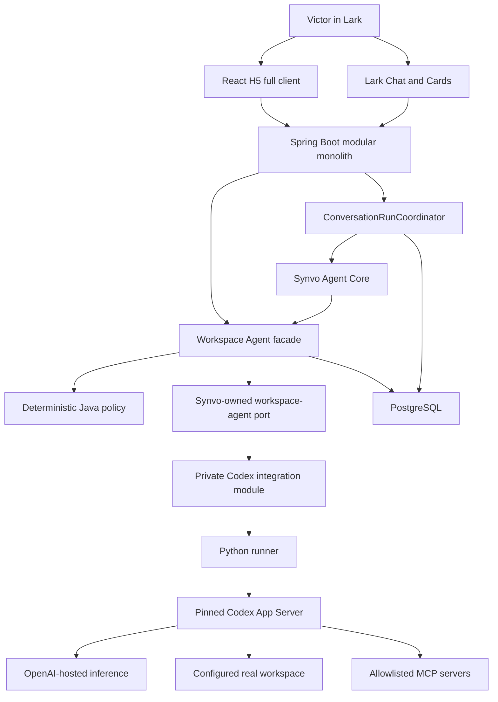
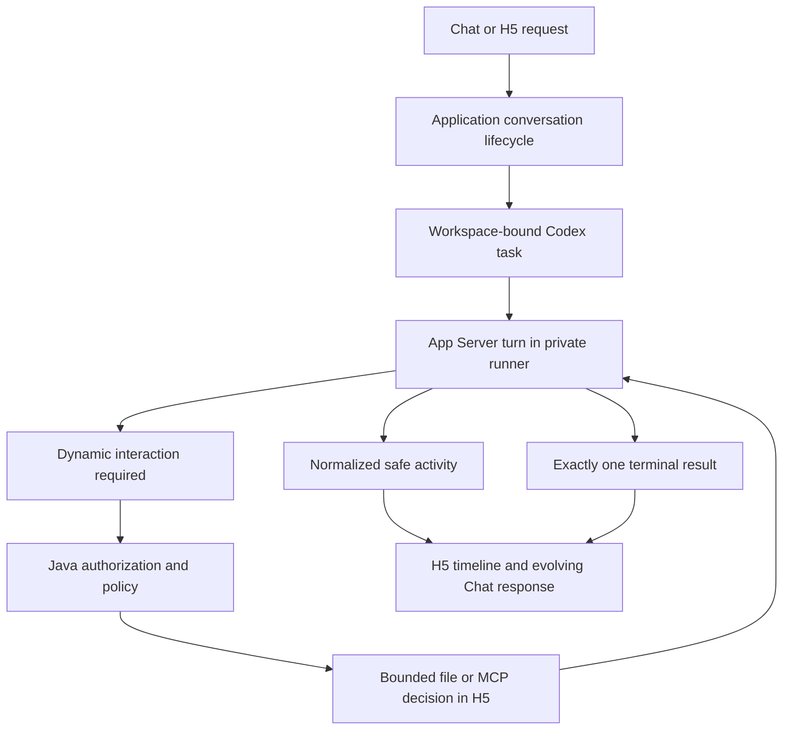

# Synvo AI Assistant — Project Overview

## Purpose

Synvo is a Lark-native AI assistant. Its current MVP foundation, **Codex in
Lark**, lets Victor operate the stable user-facing workflow capabilities of the
OpenAI Codex App Server from Lark Chat and the Lark H5 application.

The product roadmap is deliberately staged:

1. Phase 3 integrates Codex as a rich, single-user Lark client.
2. Phase 4 adds one opinionated, bounded workplace workflow that solves a
   specific Synvo work problem end to end.

This document is the high-level product and engineering reference. The exact
Phase 3 scope, contracts, security decisions, gates, and acceptance tests live
in `docs/specs/phase-3-codex-in-lark.md`.

Safe Approve is unavailable. The pinned App Server `0.148.0` behavioral gate
showed that Auto-review can approve an outside-root write and a read-only
escape before Synvo receives an approval request. Phase 3 therefore uses Ask
for Approval only. Routine work inside the selected sandbox runs without a
click. Stable command-elevation requests fail closed because their payload does
not identify enough permission detail for deterministic authorization; Synvo
does not expose command, session, prefix, persistent, or Full Access grants.

## Main Goals

### 1. Operate Codex naturally from Lark

Natural language remains the primary interface. Victor can start and continue
free-form tasks against explicitly configured real workspaces while Codex
reasons, plans, reads and changes document and numerical-data files, runs
controlled shell commands and deterministic artifact validation, uses
configured skills and allowlisted MCP tools, pauses for bounded file decisions
or MCP elicitation, reviews work, and returns results. Ask for Approval is the
only enabled reviewer mode. Routine in-sandbox work runs automatically.
Command-elevation requests are declined; only independently classifiable
workspace-relative file decisions and allowlisted MCP activity or elicitation
require a one-time H5 decision. Runner guidance batches naturally related
document and data operations without hiding unrelated actions inside a larger
command.

Phase 3 focuses on documents, reports, presentations, CSV files, and other
numerical-data artifacts. Software coding and repository-development tasks are
deferred to a future separately approved phase.

Synvo integrates the Codex harness; it does not recreate Codex's agent loop,
planner, tool selection, context management, review behavior, skill system,
MCP implementation, or internal agent coordination.

### 2. Provide one Lark-native experience

- **Lark Chat** starts or continues tasks, presents safe progress and results,
  supports cancellation, and hands rich interactions to H5.
- **Lark Cards** provide safe, actionable links to the owning H5 task.
- **React H5** is the complete task, workspace, activity, approval, bounded MCP
  elicitation, review, and result surface.

Conversation, streaming, cancellation, retry, and results share the existing
application-owned lifecycle across both surfaces. Native Chat is not required
to reproduce detailed terminal, diff, or approval interfaces that belong in
H5.

### 3. Make real workspace execution controlled and understandable

Every Synvo task is bound permanently to one configured workspace. A browser,
Lark message, model response, or persisted engine event cannot supply an
arbitrary host path.

Read-only is the default sandbox. Workspace-write is explicit. Agent-command
network access is disabled throughout Phase 3, unrestricted host access is
unavailable, and categorically forbidden boundaries fail closed under
deterministic Java policy. Routine in-boundary work proceeds without an
interaction. Opaque command-elevation requests are declined, while bounded
workspace-relative file and allowlisted MCP interactions receive one-time H5
decisions. Safe Approve is not exposed because the pinned
Auto-reviewer enlarged the effective filesystem boundary during its required
fake-canary spike. Genuine MCP elicitation remains in H5, and Full Access is
never exposed.

### 4. Preserve application ownership and trust boundaries

Synvo owns identity, authorization, configured-workspace resolution,
conversation and task lifecycle, concurrency, approval policy, idempotency,
safe persistence, audit, and presentation. Codex owns agentic reasoning and
tool execution inside the granted runner environment.

Lark credentials stay inside the existing encrypted backend lifecycle and
never reach Codex or the runner. Codex credentials and technical state stay in
a runner-owned persistent directory separated from task workspaces and never
reach Spring Boot, the browser, logs, prompts, or the repository.

### 5. Create a foundation for one useful workplace workflow

Phase 4 will select and implement one Synvo-specific bounded workflow. It will
reuse the Phase 3 task and interaction foundation without turning Agent Core
into a generic harness or exposing App Server details to product workflows.

The earlier Enterprise Knowledge Research and Meeting-to-Execution proposals
are not active Phase 3 requirements. Phase 4 requires a separately approved
specification and is not implemented implicitly as part of the Codex client.

### 6. Preserve simplicity and maintainability

We value:

- small, deep modules with narrow public interfaces;
- one application-owned conversation and task lifecycle;
- deterministic policy around permissioned execution;
- a small number of deployable components;
- protocol and vendor details hidden behind Synvo vocabulary;
- observable, testable outcomes; and
- code that can be understood without tracing pass-through layers.

## MVP Scope

### Phase 3 — Codex in Lark

Phase 3 is a single-user client for Victor's authenticated Codex subscription.
It includes the stable user-facing capability envelope needed to operate rich
document and numerical-data Codex tasks from Lark:

- configured workspace discovery and task creation;
- task/thread lifecycle and management;
- free-form turns, follow-ups, steering, streaming, cancellation, retry, and
  results;
- safe activity, plans, bounded output, file changes, diffs, and reviews;
- read-only and workspace-write execution;
- deterministic document-structure, structured-data, and numerical
  reconciliation validation instead of software test execution;
- automatic in-sandbox command execution plus bounded file and MCP decisions
  in H5;
- configured skills and allowlisted MCP tools;
- goals and stable App-Server-managed nested activity; and
- reconnect, recovery, deterministic busy behavior, and safe terminal states.

“Full stable capability” does not mean exposing every App Server endpoint or
reproducing the ChatGPT desktop UI. Experimental APIs, administrative and
diagnostic surfaces, arbitrary filesystem management, plugin marketplaces,
configuration editing, and unrelated consumer-product features remain outside
the Phase 3 product boundary. Runtime features classified as
`UnderDevelopment`, `Experimental`, or `Beta` remain disabled even if their
records appear in generated protocol schemas.

Phase 3 adds no Lark Docs, Drive, Tasks, Calendar, Base, permission, or other
business-resource reads or writes. Lark is the identity and interaction
surface, not an agent tool target in this phase.

Software coding, repository-development, build, and software-test workflows
are not Phase 3 acceptance targets. The stable Codex engine may retain those
general capabilities internally, but exposing and validating coding workflows
requires future explicit approval.

### Phase 4 — One bounded Synvo workflow

Phase 4 will define one real workplace problem and an explicit end-to-end
workflow only after Phase 3 is complete. It must preserve deterministic policy
for authorization, data boundaries, confirmation, idempotency, and audit.

If Enterprise Knowledge Research is selected later, retrieval remains live and
limited to one configured Lark Drive folder unless a new approved specification
explicitly changes that boundary.

## Technology Choices

| Layer | Technology | Role |
|---|---|---|
| Native interface | Lark Chat and Lark Cards | Task start, conversation, progress, cancellation, results, and H5 handoff |
| H5 frontend | React, TypeScript, Vite, Tailwind CSS | Complete workspace, task, activity, interaction, review, and result client |
| Backend | Java and Spring Boot | APIs, identity, policy, orchestration, Lark integration, and persistence |
| Lark integration | Lark OpenAPI Java SDK | Official WebSocket channel, messages, cards, and H5 authorization |
| Conversation foundation | Synvo Agent Core and `ConversationRunCoordinator` | Application-owned request, context, lifecycle, cancellation, and terminal semantics |
| Task foundation | Workspace Agent application facade and Synvo-owned port | Tasks, workspace binding, turns, interactions, concurrency, and normalized outcomes |
| Agent engine | OpenAI Codex with GPT-5.6 Sol | Agentic reasoning and stable workflow capabilities |
| Engine integration | One private Python runner controlling pinned Codex App Server over stable stdio JSON-RPC | Process supervision, protocol translation, capability discovery, and engine state |
| Persistence | PostgreSQL | Application task state, visible conversation state, bindings, idempotency, interactions, and safe audit |
| Client updates | REST and Server-Sent Events | Authorized commands and ordered live application events |

The Python SDK is not used in the Phase 3 production path because it does not
provide the complete bidirectional rich-client surface. The App Server is
controlled directly through its documented stable stdio protocol with the
experimental API disabled.

The runner is a private deployment sidecar, not a business microservice. It
has no Lark identity, product authorization policy, workflow definition,
product database, public endpoint, or independent scaling model.

## High-Level Architecture

## System Design

### Application-owned conversation boundary

`ConversationRunCoordinator` remains the common entry for ordinary messages
from Chat and H5. It owns message identity, duplicate suppression, visible-turn
lifecycle, cancellation entry, delivery callbacks, and exactly one terminal
outcome. `SynvoAgentCore` interprets conversational intent and delegates a
normalized Codex-capable turn; it does not learn App Server protocol or become
a universal agent harness.

### Workspace Agent application boundary

One focused application facade owns task/thread commands, configured-workspace
binding, the single active top-level turn, interaction lifecycle, replay,
retry policy, and engine outcomes. H5 task-management APIs use the same facade
for operations that are not ordinary message submission.

Surface adapters cannot reach the runner or private Java integration adapter.
They see only application concepts such as tasks, turns, activities,
interactions, results, workspace references, and normalized failures.

### Deep Codex integration module

The Synvo-owned port, private Java adapter, compressed runner contract, and
Python App Server client form one conceptual deep module. Together they hide:

- App Server process and stdio lifecycle;
- JSON-RPC framing, correlation, and server-initiated requests;
- vendor thread, turn, item, approval, model, account, and error records;
- generated schemas and capability compatibility;
- authentication and engine-state layout; and
- reconnect, interruption, orphan cleanup, and provider failure handling.

Raw App Server methods, vendor records, runner HTTP records, and Python types do
not enter Agent Core, persistence queries, REST/SSE or Lark contracts, or the
frontend. A nearly one-to-one protocol proxy is not an acceptable module.

### Deterministic policy and execution

App Server can choose tools and request interactions, but Java policy owns the
workspace, sandbox ceiling, network denial, MCP allowlist, and categorical
denials. The private integration module declines opaque command-elevation
requests. Bounded file and allowlisted MCP interactions remain
owner-authorized, expiring, idempotent one-time H5 decisions. Auto-review is
not enabled because it can resolve a sandbox escape internally before Java can
enforce those boundaries.

Only one top-level Codex turn may be active system-wide in Phase 3. Additional
starts receive a deterministic busy result without contacting App Server.
App-Server-managed nested activity remains inside the active task and inherits
its owner, workspace, sandbox, approval, and cancellation boundaries.

### Lark integration boundary

Lark Chat uses the official WebSocket channel. H5 uses backend-verified Lark
authorization plus REST/SSE. Tokens are exchanged and encrypted by Spring Boot
and never reach the model, runner, or browser.

The Permissioned Lark Action Gateway remains the required boundary for any
future Lark resource operation. No Phase 3 MCP server or agent tool may bypass
it, and Phase 3 exposes no Lark business-resource operation at all.

### State and sensitive data

PostgreSQL is authoritative for Synvo task metadata, visible messages, safe
replay projections, idempotency, interaction state, safe audit metadata, and
opaque engine-thread bindings. App Server owns replaceable engine thread state.

Raw commands, command output, diffs, reasoning, file content, credentials,
configured paths, and unrestricted MCP payloads are not persisted in Phase 3
tables or approval audits. Authorized H5 detail is bounded, redacted,
owner-only, transient, and delivered without browser caching.

## Interaction Flow

## Simplicity Principles

1. **Integrate the Codex harness; do not rebuild it.**
2. **Keep App Server complexity inside one deep integration module.**
3. **Use Synvo task and interaction vocabulary outside that module.**
4. **Keep model reasoning separate from deterministic permissioned execution.**
5. **Keep Phase 3 client mechanics separate from Phase 4 product workflow logic.**
6. **Use one Spring Boot modular monolith, one React app, PostgreSQL, and one private runner.**
7. **Use configured workspaces, explicit sandboxes, and H5 approval.**
8. **Use PostgreSQL before adding data infrastructure.**
9. **Add abstractions only for current requirements or a second real implementation.**
10. **Prefer observable, testable outcomes over opaque application behavior.**

## MVP Non-Goals

The current MVP does not include:

- a Synvo-owned generic agent-building platform, agent loop, planner, tool
  registry, skill marketplace, workflow engine, or multi-agent orchestrator;
- Phase 4's workplace workflow before it receives an approved specification;
- Enterprise Knowledge Research, configured Lark Drive retrieval, citations,
  or Meeting-to-Execution in Phase 3;
- Lark business-resource reads or writes in Phase 3;
- multi-user access, shared tasks, group messages, or organization provisioning;
- OpenAI API-key authentication;
- arbitrary host paths, automatic repository discovery, or automatic cloning;
- unrestricted host access, Full Access, unattended forbidden external writes,
  or approval bypass outside the selected task reviewer mode;
- generic App Server user-input or permission requests, agent-command network
  access, or web-search feature paths while the pinned runtime classifies them
  below `Stable`;
- experimental App Server APIs or exact ChatGPT desktop/CLI feature parity;
- enterprise-wide knowledge ingestion or search across every accessible Lark
  resource;
- a separate vector database, message broker, Redis, workflow engine,
  microservices, Kubernetes, or another application database; or
- automatic or destructive Lark operations.

## Success Criteria

The foundation is successful when:

- Victor can operate a stable Codex task from both Lark surfaces without
  learning App Server commands or protocols;
- H5 supports the complete approved stable workflow envelope and Chat provides
  a coherent companion experience with secure H5 handoff;
- real workspace analysis and approved changes remain inside the configured
  root and granted sandbox;
- dynamic interactions are authorized, policy-bounded, idempotent, auditable,
  and safely recoverable;
- Ask for Approval remains owner-controlled in H5, and MCP elicitation remains
  human-owned;
- cancellation, retry, reconnection, busy handling, and all failures produce
  deterministic visible outcomes without duplicate work;
- no Lark or Codex credential crosses its owning boundary or appears in code,
  logs, persistence, prompts, output, or browser storage;
- most App Server changes affect only the deep integration module and its
  contract tests; and
- Phase 4 can add one bounded workplace workflow without replacing the
  conversation, task, security, or integration foundations.

## Transition from Phase 2.5

The completed Phase 2.5 implementation remains the verification baseline:
Spring Boot and React share the application-owned conversation lifecycle,
PostgreSQL has migrations V1 through V4, Lark Chat uses the official WebSocket
channel, H5 uses REST/SSE and Lark authorization, and Nemotron is the current
model through the Synvo-owned gateway.

Phase 3 replaces Nemotron and removes its Spring AI/NVIDIA runtime path only
after Codex conversation and task parity has passed. The first Phase 3
migration is V5. The stack must retain a healthy, credential-free disabled
runner mode throughout the transition.

## Guiding Product Statement

> Synvo brings the stable Codex workflow experience into Lark through a
> trustworthy application-owned boundary, then uses that foundation for one
> focused workplace workflow rather than building another agent platform.
