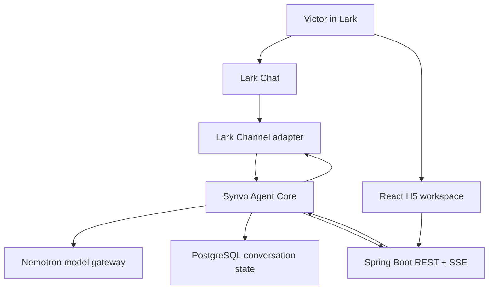

# Phase 2 — Agentic Conversation

Status: **Complete**
Last updated: 2026-08-18

## Purpose

Phase 2 replaces the deterministic Phase 1 acknowledgement with a natural,
model-powered conversation experience across Lark Chat and the React H5 Web
App.

The phase proves this vertical slice:

```text
Natural-language request
    → Synvo Agent Core
    → NVIDIA Nemotron
    → one responsive, streaming conversation
```

Phase 2 establishes the application workspace, Agent Core, conversation state,
streaming lifecycle, and reusable workflow presentation primitives. It does not
implement the complete Enterprise Knowledge Research or Meeting-to-Execution
workflows.

## Confirmed Decisions

| Area | Decision |
|---|---|
| Phase structure | Four sequential checkpoints: 2.1 UI/UX Foundation, 2.2 Agent Core, 2.3 Streaming Conversation, 2.4 Workflow-Ready UI |
| Primary model | NVIDIA Nemotron 3 Super 120B |
| Agent foundation | Synvo-owned Agent Core using selected Spring AI capabilities behind application interfaces |
| Initial user | Victor only |
| Lark Chat scope | Direct messages with Synvo; group conversations remain disabled |
| Complex conversation surface | React H5 Web App inside Lark |
| H5 live updates | REST commands and Server-Sent Events |
| Lark response style | One evolving response per user turn rather than multiple temporary messages |
| Workspace layout | Collapsible sidebar, compact conversation top bar, main conversation area, and optional artifact panel |
| Sidebar identity | Do not repeat Victor's profile; Lark already owns user identity chrome |
| Sidebar footer | One compact Settings entry with a two-state assistant readiness indicator |
| Settings scope | Knowledge Sources and Lark Permissions |
| H5 waiting style | Synvo-owned accessible typing wave until the first response token |
| Activity disclosure | Safe operational activity only; never model chain-of-thought |
| Theme | Follow the Lark or system light/dark appearance |
| Persistence | PostgreSQL remains the only application database |

## Objectives

1. Establish a focused, responsive AI workspace inside the existing Lark H5
   application.
2. Introduce the Synvo Agent Core as the application-owned conversation and
   orchestration boundary.
3. Connect NVIDIA Nemotron through a replaceable model gateway.
4. Support natural direct answers, concise clarification, and explicit
   recognition of future workflow intents.
5. Preserve bounded conversation context without building a generic memory
   platform.
6. Stream one evolving assistant response to Lark Chat and H5.
7. Give users immediate, accessible feedback while the model or a registered
   operation is running.
8. Establish reusable UI contracts for sources, citations, activity, artifacts,
   and confirmation without implementing the two complete MVP workflows.
9. Preserve every Phase 1 identity, permission, encryption, deduplication,
   audit, and response-routing guarantee.
10. Prove all behavior with focused automated, integration, Docker, and live
    Lark verification.

## Scope

### 2.1 UI/UX Foundation

Build the authorized H5 workspace shell before model integration.

The shell contains:

- A collapsible Synvo sidebar.
- A New Conversation control. Conversation search is intentionally deferred
  until the recent-conversation list demonstrates a real need for it.
- The two planned workflow entry points: Enterprise Knowledge Research and
  Meeting-to-Execution. They must not pretend to execute workflows before those
  workflows exist.
- Recent conversation navigation backed initially by development fixtures and
  later by real Phase 2 conversation state.
- The current conversation remains visibly highlighted in both expanded and
  collapsed sidebar states. Starting a new conversation clears the prior
  selection highlight.
- In the expanded sidebar, a recent conversation reveals a delete action on
  hover or keyboard focus. Deletion requires explicit confirmation, is scoped
  to the authorized owner, removes the conversation and its dependent state,
  and returns an active deleted conversation to a new empty conversation. After
  backend confirmation, the deleted row uses one brief exit animation before
  removal. Active runs cannot be deleted, and the compact sidebar does not
  expose the destructive control.
- One compact Settings entry containing Knowledge Sources and Lark Permissions.
- Settings provides a back control that returns to the previously active
  conversation without discarding or reloading its current state.
- A compact top bar containing the current conversation title and contextual
  actions.
- A main conversation stream and persistent prompt composer.
- An optional right-side artifact panel that collapses or becomes a drawer when
  space is limited.

Remove the Phase 1 branding-only page header and `Running in Lark` badge from the
authorized workspace. Keep Lark's native window header untouched. Do not repeat
Victor's name, avatar, or account menu inside the sidebar.

The Phase 1 connection experience remains the authorization gate. An
unauthorized user sees the connection experience; an authorized Victor enters
the workspace. A compact green or pink/red readiness indicator beside Settings
is always visible. Detailed connection health appears only when attention is
required or inside Settings.

Use fixtures only to develop and test presentation states. Production controls
must not trigger fake model runs, fake retrieval, or fake Lark actions.

### 2.2 Agent Core

Introduce the smallest application-owned conversation core required for direct
answers and clarification.

The Agent Core owns:

- One explicit conversation entry point shared by Lark Chat and H5 adapters.
- Conversation identity and bounded turn context.
- Intent outcomes for direct answer, clarification, research intent, and
  meeting intent.
- Model invocation through a Synvo-owned gateway.
- A registry boundary for explicitly allowed tools and future workflows.
- Safe lifecycle events independent of any UI surface.
- Terminal success and failure outcomes.

Direct answer and clarification are executable Phase 2 behaviors. Research and
meeting intents may be recognized, but must return an honest unavailable or
handoff state until their later phases implement the corresponding workflows.

The Agent Core must not become a generic agent platform. Provider-specific
Spring AI and Nemotron types remain behind Synvo-owned interfaces. Model output
cannot invent tools or bypass deterministic application policy.

Store only the minimum conversation, turn, and lifecycle state required for
continuity, retry safety, and audit. Apply a documented bounded-context policy.
Do not introduce long-term user profiling, a vector database, or a separate
memory service.

### 2.3 Streaming Conversation

Connect the Agent Core lifecycle to both user surfaces.

Shared lifecycle:

```text
accepted
  → thinking
  → streaming
  → completed

accepted
  → thinking or streaming
  → failed
```

`tool_running` may be emitted only when a real registered operation is running.
These are product states, not reasoning traces. Every accepted turn must reach a
terminal `completed` or `failed` state.

For Lark Chat:

- Start one response promptly after accepting a supported direct message.
- Use the supported Lark Java Channel streaming behavior to evolve that same
  response.
- Keep ordinary direct messages unanchored.
- Preserve an explicit Lark Reply anchor.
- Turn timeout or generation failure into one concise final error state.
- Do not send message-per-token output or leave a permanent thinking message.

For H5:

- Render the user's submitted turn immediately.
- Automatically reveal each newly submitted user turn above the composer. Keep
  following streamed content while the user remains near the bottom, but stop
  automatic scrolling when the user deliberately scrolls upward.
- Create one pending assistant turn with an accessible typing wave.
- Replace the wave in place when the first SSE content event arrives.
- Append ordered content deltas to that same assistant turn.
- Support stop, retry, reconnect, and safe failure behavior only where the
  backend lifecycle supports them.
- Replace a stopped or failed visible attempt in place when the user retries;
  do not append another copy of the user prompt or retain the obsolete error in
  conversation history. Preserve the superseded run for backend audit.
- On one transient provider-stream interruption, automatically clear the
  partial draft and regenerate once through a non-streaming provider request in
  the same assistant turn. Keep recovery bounded and expose a safe failure only
  if regeneration also fails.
- Persist conversations and expose real recent-conversation navigation.
- Generate or derive concise conversation titles without delaying the primary
  answer.
- Reveal compact actions for completed assistant turns: copy the original
  response, show the local completion time, and present Branch in New Chat as a
  disabled coming-soon control until branching is implemented.
- Render response completion times consistently in Singapore time and let the
  prompt composer grow with longer input up to a bounded height before
  scrolling internally.
- Respect reduced-motion preferences and keyboard accessibility.

Do not add another WebSocket, message broker, Redis stream, or separate
streaming service. REST and SSE are sufficient for the H5 MVP.

### 2.4 Workflow-Ready UI

Add a small set of presentation contracts that the later research and meeting
phases can reuse:

- Safe activity states.
- Tool or operation labels for real registered activity.
- Citations and links to original Lark resources.
- Source summaries and previews.
- Structured artifacts in the optional right-side panel.
- Review and confirmation requests that do not execute actions themselves.
- Empty, loading, partial, completed, failed, and unavailable states.

The Settings view contains:

- Knowledge Sources: the configured source boundary and its connection state.
- Lark Permissions: authorization state, available capabilities, reauthorization,
  and disconnect controls.

Build only primitives required by current Phase 2 states and the two approved
future workflows. Do not create a generic design-system package, visual workflow
builder, plugin surface, or speculative dashboard.

Workflow UI components may be exercised with test fixtures, but production UI
must render them only from real backend events. Complete Drive retrieval,
meeting processing, citations generated from enterprise evidence, and Lark write
execution remain later-phase work.

## Architecture



The Agent Core owns conversation decisions and lifecycle events. Surface
adapters translate those events into Lark streaming messages or H5 SSE updates;
they do not contain agent reasoning or provider-specific policy.

## Deliverables

### 2.1 UI/UX Foundation

- [x] Authorized workspace shell with sidebar, top bar, conversation area,
      composer, and optional artifact panel.
- [x] Preserved Phase 1 authorization gate and safe connection states.
- [x] Compact Settings view with Knowledge Sources and Lark Permissions.
- [x] Responsive desktop, narrow-window, and mobile-sized layouts.
- [x] Accessible light, dark, keyboard, focus, and reduced-motion behavior.
- [x] Focused Synvo-owned tokens and components with no general component
      platform.
- [x] Confirmed, owner-scoped recent-conversation deletion with safe active-run
      protection and active-view reset.

### 2.2 Agent Core

- [x] Minimal Spring AI dependencies for the selected Nemotron integration.
- [x] Synvo-owned model gateway and validated secret-safe configuration.
- [x] Explicit Agent Core conversation entry point.
- [x] Direct-answer and clarification behavior.
- [x] Honest recognition of future research and meeting intents without fake
      workflow execution.
- [x] Bounded PostgreSQL conversation and turn state.
- [x] Explicit registry and policy boundary for future tools.

### 2.3 Streaming Conversation

- [x] Shared lifecycle protocol with terminal success and failure states.
- [x] One evolving Lark response per accepted direct-message turn.
- [x] H5 REST submission and SSE event stream.
- [x] Accessible typing wave replaced in place by streaming content.
- [x] Stop, retry, reconnect, timeout, and safe failure behavior.
- [x] Completed-response actions with clipboard copy, completion time, and a
      disabled future branching affordance.
- [x] Real recent-conversation navigation and conversation titles.
- [x] Preserved normal-DM, explicit-reply, deduplication, and audit behavior.

### 2.4 Workflow-Ready UI

- [x] Typed activity, citation, source, artifact, and confirmation presentation
      contracts.
- [x] Optional artifact panel and narrow-screen drawer behavior.
- [x] Production rendering only for real backend events.
- [x] No raw chain-of-thought or unsupported action controls.

## Test Plan

### 2.1 UI/UX Foundation tests

- [x] Unauthorized users remain on the connection experience.
- [x] Authorized Victor enters the workspace.
- [x] Sidebar collapse, conversation selection, artifact-panel toggle, and
      Settings navigation work with keyboard and pointer input.
- [x] The current recent conversation remains visibly selected in expanded and
      collapsed sidebar states, and New Conversation clears that selection.
- [x] The sidebar does not duplicate Victor's Lark identity.
- [x] Settings contains Knowledge Sources and Lark Permissions only at this
      checkpoint.
- [x] The Settings row exposes a motion-safe green connected state and pink/red
      disconnected state in both expanded and collapsed sidebars.
- [x] Settings returns to the previously active conversation without reloading
      or losing its visible turns.
- [x] No fixture control produces a real model, retrieval, or Lark action.
- [x] Desktop, narrow-window, and mobile-sized layouts remain usable.
- [x] Light, dark, visible-focus, and reduced-motion states remain accessible.
- [x] Recent-chat deletion is available by pointer and keyboard focus only in
      the expanded sidebar; cancel preserves the chat, confirmation cascades
      its persisted state through a brief post-success exit animation, and
      failure leaves the chat visible with a safe error.
- [x] Frontend tests, typecheck, lint, and production build pass.

### 2.2 Agent Core tests

- [x] Model configuration is disabled by default and rejects missing required
      values without exposing secrets when enabled.
- [x] Tests use a fake model gateway and make no live model calls.
- [x] Direct-answer and clarification outcomes are explicit and deterministic at
      the routing boundary.
- [x] Research and meeting intents cannot invoke unregistered workflows.
- [x] Model-generated tool names or arguments cannot bypass the registry and
      policy boundary.
- [x] Conversation context is bounded using the documented policy.
- [x] Provider failures become safe terminal outcomes.
- [x] Model credentials, raw sensitive prompts, and chain-of-thought do not
      appear in logs or HTTP responses.

### 2.3 Streaming Conversation tests

- [x] A supported turn creates one Agent Core run and one assistant response.
- [x] Lifecycle events occur in a valid order and terminate in `completed` or
      `failed`.
- [x] Ordered model deltas update one response rather than creating
      message-per-token output.
- [x] H5 submission immediately renders the user turn and one pending assistant
      turn.
- [x] The first SSE content event replaces the typing wave without adding a
      second assistant turn.
- [x] New prompts cannot remain hidden below the visible conversation area;
      streaming remains bottom-pinned only until the user scrolls upward.
- [x] Stop, timeout, disconnect, reconnect, and retry produce consistent final
      state without duplicate generation.
- [x] Retry replaces the failed visible user/assistant pair in place, remains
      clean after history reload, and preserves the superseded backend run for
      audit.
- [x] One transient provider-stream interruption resets partial H5 and Lark
      content, regenerates once through the bounded non-streaming fallback in
      the same assistant turn, and persists only the regenerated final answer.
- [x] A normal Lark direct message remains unanchored; an explicit reply
      preserves its anchor.
- [x] Duplicate Lark delivery does not create another agent run or response.
- [x] Conversation history and titles survive a backend restart.

### 2.4 Workflow-Ready UI tests

- [x] Activity, citation, source, artifact, confirmation, unavailable, and error
      fixtures render through typed contracts.
- [x] Citations expose understandable source names and usable Lark links.
- [x] The artifact panel collapses and becomes a drawer when space is limited.
- [x] Confirmation UI cannot execute a Lark write without a separately
      registered backend action and policy decision.
- [x] User-visible activity never exposes private chain-of-thought.
- [x] Production UI does not present fixture workflow output.

### Regression and integration tests

- [x] Phase 1 identity, authorization, encrypted token persistence,
      deduplication, and pilot restrictions continue to pass.
- [x] Flyway creates conversation schema against PostgreSQL Testcontainers.
- [x] The ordinary Lark-disabled and model-disabled Docker stack remains healthy
      without external credentials or a tunnel.
- [x] The complete backend and frontend verification commands pass.

### Live Lark smoke test

- [x] Victor opens the authorized H5 workspace inside Lark.
- [x] A standalone direct message produces one normal evolving response without
      quoted reply decoration.
- [x] An explicit Lark Reply preserves its anchor.
- [x] H5 submits a prompt, shows immediate waiting feedback, and streams one
      completed response.
- [x] A controlled model delay demonstrates the waiting-to-streaming transition.
- [x] A controlled failure does not leave a permanent thinking state.
- [x] Restarting the backend preserves conversation and authorization state.
- [x] Logs contain no model key, Lark token, connection ticket, unredacted
      sensitive prompt, or message body.

## Acceptance Criteria

Phase 2 is complete when:

1. Authorized Victor enters a responsive H5 workspace with the approved
   sidebar, top-bar, conversation, composer, artifact-panel, and Settings
   structure.
2. Victor can have coherent, model-powered direct conversations with Synvo in
   both Lark Chat and H5.
3. The Agent Core explicitly distinguishes direct answer, clarification,
   research intent, and meeting intent without executing unavailable workflows.
4. Lark and H5 provide immediate waiting feedback and maintain one evolving
   assistant response per accepted user turn.
5. H5 streaming uses REST and SSE, and every accepted turn reaches a completed
   or failed terminal state.
6. Conversation continuity and recent history survive a backend restart within
   the documented bounded-context policy.
7. Normal direct messages, explicit replies, duplicate delivery, authorization,
   encryption, pilot restriction, and audit behavior remain correct.
8. Settings exposes the configured knowledge-source boundary and Lark
   permission state without duplicating Lark account UI.
9. Typed workflow-ready UI can present real activity, citations, sources,
   artifacts, and confirmations without implementing fake workflows or writes.
10. No credential, token, private chain-of-thought, or unredacted sensitive
    prompt appears in user-visible activity, logs, browser storage, or responses.
11. The codebase remains one React application, one Spring Boot modular
    monolith, and one PostgreSQL database.
12. All required automated, PostgreSQL, Docker, regression, and controlled live
    Lark verification passes or has an explicit user-approved waiver recorded in
    the Completion Audit.

## Explicit Non-Goals

Phase 2 does not include:

- Complete configured-Drive retrieval, research synthesis, or grounded
  enterprise citations.
- Complete Meeting-to-Execution extraction or execution.
- Lark Tasks, Calendar, Base, Docs, Drive, or approval write execution.
- Group conversation support.
- A custom native typing indicator inside Lark Messenger.
- Raw model chain-of-thought.
- Enterprise-wide ingestion or retrieval.
- A vector database or generic memory platform.
- Multiple models exposed to the user or a model selector.
- Projects, plugins, customization studios, or a generic agent marketplace.
- A message broker, Redis stream, separate streaming service, or microservice.
- A generic design-system package or visual workflow builder.
- A multi-agent system or agent swarm.

## Checkpoint Verification

### 2.1 UI/UX Foundation — Passed on 2026-08-18

- `npm test`: 23 tests passed across four test files.
- `npm run typecheck`, `npm run lint`, and `npm run build`: passed.
- Real-browser checks covered the 1440-by-900 desktop layout, 900-pixel
  artifact drawer, and 390-pixel mobile layout.
- Browser accessibility inspection confirmed named collapsed controls,
  keyboard-visible focus, mobile sidebar collapse after navigation, and the
  absence of duplicate Victor identity chrome.
- The recent-chat deletion refinement adds hover and keyboard-focus discovery,
  an accessible confirmation dialog with focus containment and restoration,
  safe failure handling, and active-chat reset. PostgreSQL integration proves
  owner isolation, active-run protection, and cascade deletion of turns, runs,
  events, and the Lark chat binding.
- Dark appearance was rendered in-browser; the existing light variables and
  `prefers-color-scheme`, visible-focus, and `prefers-reduced-motion` rules
  remain shared by the authorization gate and authorized workspace.
- No waiver was required.

### 2.2 Agent Core — Passed on 2026-08-18

- The dependency tree contains the focused `spring-ai-openai` and transitive
  Spring AI model modules only; no Spring AI starter, Alibaba agent framework,
  or competing orchestration framework was introduced.
- Model integration is disabled by default. Validation tests reject incomplete
  and malformed enabled configuration while redacting configured values.
- The Synvo-owned gateway uses the NVIDIA-compatible OpenAI path without
  exposing provider types to the Agent Core. Tests use a fake gateway and make
  no external model calls.
- Agent Core tests cover direct answers, clarification, unavailable research
  and meeting intents, provider failure, and idempotent terminal replay.
- Operation registry and deny-by-default policy tests prove that unregistered
  and unauthorized operations cannot execute.
- PostgreSQL integration tests prove Flyway schema v2, owner isolation,
  persisted lifecycle state, replay, the 12-message context bound, and the
  24,000-character context bound.
- `./mvnw test`: 51 tests passed with no failures or errors.
- `./mvnw package`: passed and produced the executable Spring Boot archive.
- No waiver was required.

### 2.3 Streaming Conversation — Passed on 2026-08-18

- Focused Agent Core, coordinator, REST/SSE, Lark channel, and response-routing
  tests passed: 25 tests with no failures or errors.
- Agent lifecycle tests prove contiguous ordered events, multiple ordered model
  deltas, exactly one terminal result, cancellation, timeout, and safe failure.
- H5 tests prove immediate user and pending-assistant turns, in-place typing-wave
  replacement, ordered deltas in one assistant turn, duplicate-submit
  prevention, stop, reconnect, retry, and terminal failure behavior.
- PostgreSQL integration tests prove one persisted assistant turn, SSE replay
  after `Last-Event-ID`, owner isolation, real history and title retrieval,
  restart recovery, and Lark-chat conversation continuity.
- Lark tests prove one evolving streamed response, safe replacement of partial
  output after failure, unanchored ordinary direct messages, anchored explicit
  replies, pilot-only routing, and duplicate-delivery suppression.
- No waiver was required.

### 2.4 Workflow-Ready UI — Passed on 2026-08-18

- Runtime-validated TypeScript unions cover safe activity, citation, source,
  artifact, confirmation, unavailable, and error presentations.
- Presentation tests cover every artifact lifecycle state, understandable source
  labels, HTTPS-only Lark and Feishu resource links, and accessible status and
  alert semantics.
- The artifact panel reuses the responsive panel verified in checkpoint 2.1;
  at widths below 980 pixels it becomes an overlay drawer while preserving the
  same typed presentation list.
- Production starts with an empty artifact panel. Workflow presentations are
  accepted only from validated SSE payloads; malformed or non-Lark links are
  discarded without dropping safe conversation content.
- Confirmation is a disabled review-only control with no action identifier,
  request handler, registered write, or Lark execution path.
- Assistant responses render safe CommonMark structure with styled paragraphs,
  lists, emphasis, headings, links, quotations, and code. Raw HTML, remote
  images, and non-HTTP links remain disabled.
- `npm test`: 59 tests passed across eight test files. Type-check, lint, and the
  production build passed.
- No waiver was required.

## Completion Audit

Status: **Complete — automated, PostgreSQL, Docker, and live Lark/Nemotron
verification passed with no waiver**

| # | Acceptance criterion | Current evidence | Result |
|---|---|---|---|
| 1 | Approved responsive H5 workspace | Checkpoint 2.1 component, accessibility, responsive, and real-browser evidence; Victor confirmed the authorized H5 workspace opens inside Lark | Passed |
| 2 | Model-powered conversation in Lark and H5 | Victor confirmed completed live Nemotron conversations in Lark Chat and H5 | Passed |
| 3 | Explicit direct, clarification, research, and meeting intent outcomes | `IntentRouterTests`, `IntentRouterAuditTests`, and `SynvoAgentCoreTests`; 86-case routing matrix passes and unavailable workflows cannot execute | Passed |
| 4 | Immediate feedback and one evolving response on both surfaces | Live Lark evolving response passed; Victor confirmed H5 waiting-to-streaming, controlled delay, completed response, and controlled-failure behavior | Passed |
| 5 | REST/SSE and terminal lifecycle | Controller, coordinator, Agent Core, frontend API, and workspace tests | Passed |
| 6 | Persisted continuity and bounded context after restart | PostgreSQL integration proves history, titles, 12-message and 24,000-character bounds, and interrupted-run recovery; live restart preserved one active encrypted authorization record plus six conversations and 44 turns with unchanged fingerprints | Passed |
| 7 | Reply routing, deduplication, authorization, encryption, pilot, and audit preservation | Phase 1 regression, PostgreSQL, auth, channel, and routing tests; live normal-DM and explicit-reply behavior passed | Passed |
| 8 | Source and permission Settings without duplicate identity | Workspace and application tests plus checkpoint 2.1 browser evidence | Passed |
| 9 | Typed, real-event-only workflow presentation without writes | Presentation contract, SSE validation, workspace, and disabled-confirmation tests | Passed |
| 10 | No credentials, private reasoning, sensitive prompt, or browser-token leakage | Safe configuration/error tests, no production browser storage, repository secret-shape scan, and final count-only live Docker log and logging-source scan returned zero hits | Passed |
| 11 | One React app, Spring Boot modular monolith, and PostgreSQL | Repository and Compose topology inspection | Passed |
| 12 | Complete automated, PostgreSQL, Docker, regression, and controlled live verification | All automated gates and controlled live checks passed without a waiver | Passed |

Automated verification evidence on 2026-08-18:

- `./mvnw test`: 166 tests passed, including PostgreSQL 18 Testcontainers and
  clean Flyway migrations through v4.
- `./mvnw package`: passed and produced the executable Spring Boot archive.
- `npm ci`, `npm test`, `npm run typecheck`, `npm run lint`, and
  `npm run build`: passed; the current suite has 61 frontend tests across eight
  files.
- `docker compose config --quiet`, image builds, and
  `docker compose up --detach --wait`: passed with Lark and the model disabled.
- Backend and proxied frontend health endpoints returned ready/UP.
- A count-only redacted disabled-stack log scan found zero sensitive-data
  markers and zero runtime errors.
- `.env` and `tasks/` remain ignored, `git diff --check` passed, and a
  filename-only repository scan found no Lark or NVIDIA secret-shaped literal.
- No waiver has been requested or granted.

User-confirmed live Lark acceptance on 2026-08-18:

- The authorized H5 workspace opens inside Lark.
- A submitted H5 prompt shows immediate waiting feedback, streams, and reaches
  one completed response.
- A deliberate model delay visibly transitions from waiting to streaming.
- A controlled failure reaches a terminal failure state and does not leave a
  permanent thinking indicator.

Final live infrastructure verification on 2026-08-18:

- The restart audit confirmed there was no active agent run before restarting
  the backend.
- Docker reported the restarted backend healthy and the Lark WebSocket channel
  returned to `connected`.
- The active encrypted authorization-record count, conversation count, turn
  count, and authorization/conversation/turn fingerprints were identical
  before and after restart. The live dataset contained one active authorization
  record, six conversations, and 44 turns.
- A count-only scan across backend, frontend, and PostgreSQL logs found zero
  exact configured-secret or pilot-identifier matches and zero sensitive
  credential, prompt, request-body, response-body, or message-content markers.
- A source-level scan found zero logging calls referencing prompt, content,
  authorization, credential, connection-ticket, or message-body values.

### Routing Audit — Passed on 2026-08-18

The permanent `IntentRouterAuditTests` matrix exercises 86 representative
utterances across six routing categories. The baseline router passed 42 cases
and failed 44. The corrected router passes all 86 cases.

| Routing category | Baseline | Final |
|---|---:|---:|
| General and direct-answer prompts | 18/20 | 20/20 |
| Explicit enterprise research requests | 10/18 | 18/18 |
| Explicit meeting-execution requests | 7/18 | 18/18 |
| Ambiguous requests requiring clarification | 5/12 | 12/12 |
| Mixed research and meeting requests | 0/6 | 6/6 |
| Negated, hypothetical, and non-executing references | 2/12 | 12/12 |
| **Total** | **42/86** | **86/86** |

The audit exposed and corrected six defect classes: guidance prompts activating
workflows, real enterprise requests being missed, normalization and vocabulary
gaps, vague references bypassing clarification, mixed intents being resolved by
precedence, and negated or hypothetical language activating workflows.

Focused routing and Agent Core verification passed 98 tests. The complete
backend suite passed 157 tests with PostgreSQL 18 Testcontainers and Flyway
migrations, and the executable-package build passed. New routing defects must be
added to the permanent matrix before their correction is accepted.

Do not change the phase status to `Complete` until all pending live-verification
rows have direct evidence or an explicit user-approved waiver.

## Primary References

- [Lark Java SDK — Channel guide](https://github.com/larksuite/oapi-sdk-java/blob/v2_main/CHANNEL.md)
- [Lark H5 Web App introduction](https://open.larksuite.com/document/client-docs/h5/introduction)
- [Lark OpenAPI Java SDK](https://github.com/larksuite/oapi-sdk-java)
- [Beautiful UI — AI-native interface patterns](https://www.beautifului.dev/)
