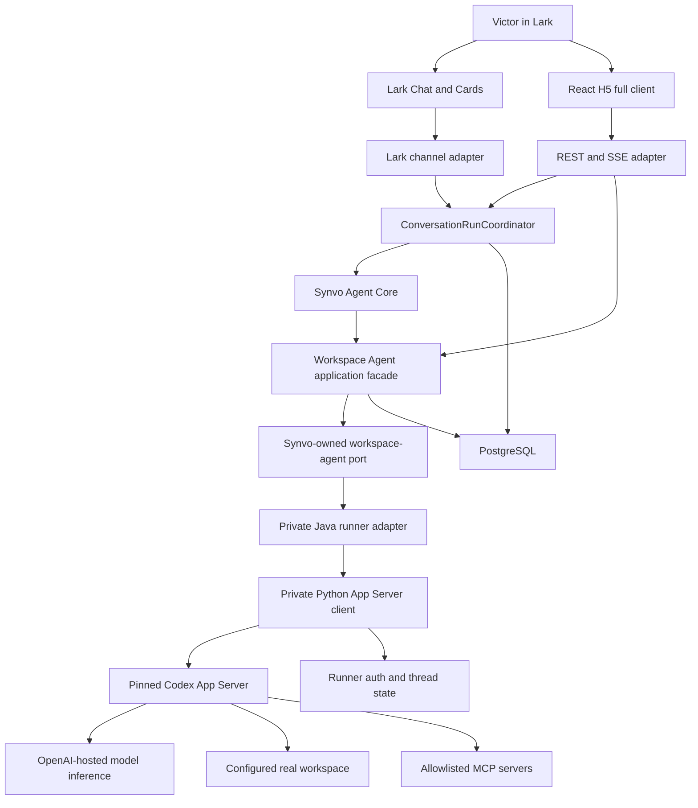

# Phase 3 — Codex in Lark

Status: **Complete**
Last updated: 2026-08-24
Stable-only amended specification approved by Victor: 2026-08-21
Document-and-data acceptance amendment approved by Victor: 2026-08-22
Safe Approve product direction selected by Victor (superseded): 2026-08-23
Safe Approve specification amendment approved by Victor (superseded): 2026-08-23
Safe Approve pinned-runtime hard gate failed: 2026-08-23
Ask for Approval plus bounded session approval selected by Victor (superseded): 2026-08-23
Ask for Approval plus bounded session approval approved by Victor (superseded): 2026-08-23
Sandbox-bounded reduced-click approval approved by Victor: 2026-08-23
H5-only employee rollout and native-Chat verification waiver approved by Victor: 2026-08-24
Live competing-request verification removed from Phase 3 closure by Victor: 2026-08-24
Phase 3 completion directed by Victor after final must-pass verification: 2026-08-24

## Purpose

Phase 3 turns Synvo into a single-user, Lark-native client for the stable
agentic-workflow capabilities exposed by the OpenAI Codex App Server.

Victor can use Lark H5 to start and manage free-form Codex tasks in explicitly
configured real workspaces. Codex may inspect files, reason, plan, run shell
commands, edit document and numerical-data files, validate resulting artifacts
deterministically, use configured skills and MCP tools, request bounded file or
MCP-elicitation decisions, spawn App-Server-managed subagents when the
stable runtime chooses to do so, review
changes, and return a result. H5 is the full interaction, human-input, and
manual-approval surface. Phase 3 uses **Ask for Approval** only. Routine work
inside the selected read-only or workspace-write sandbox proceeds without a
click. Because the stable command-approval request does not identify the
additional sandbox permission being requested, every command-elevation request
fails closed instead of becoming an H5 approval. Bounded workspace-relative
file decisions and allowlisted MCP interactions remain one-time H5 decisions.
Synvo does not expose Auto-review, Safe Approve, command-session or
command-prefix grants, or Full Access.
H5 is the only supported employee interaction surface for the current rollout.
Native Lark Chat remains implemented as a deferred companion path, but Victor
explicitly waived all native-Chat and Lark-to-H5 tests for Phase 3 closure on
2026-08-24 because employees will use H5. Native Chat must be re-verified under
a future approved test plan before it is promoted back into a supported
employee workflow.

Phase 3 integrates the Codex harness; it does not recreate an agent loop in
Synvo. Model inference is OpenAI-hosted, while shell commands, file access,
skills, local MCP servers, and other local tools execute inside the private
runner environment against the selected workspace.

Phase 4 remains separate. It will build one opinionated Synvo workplace
workflow on top of this foundation rather than adding more integration
plumbing.

Phase 3 acceptance focuses on documents, reports, presentations, CSV files,
and other numerical-data artifacts. Software coding, repository-development,
and developer-toolchain workflows are deferred to a future separately approved
phase. The underlying stable Codex runtime may retain those general
capabilities, but Phase 3 does not require or validate them as product tasks.

This specification supersedes the earlier constrained SDK-and-fixture design. That
approach is abandoned. Implementation must not restore its fixed
`CONTROLLED_FIXTURE` route, deny-all engine policy, precomputed command model,
or public-SDK-only restriction.

## Product-Direction Change

The user approved this Phase 3 direction on 2026-08-20:

> Build a single-user Lark client for the full stable App Server capability
> set—free-form Codex tasks, real workspaces, shell and file operations,
> dynamic H5 approvals, skills, MCP tools, thread management, steering,
> review, cancellation, and results.

This direction intentionally changes the earlier project boundary. Earlier
versions of `AGENTS.md` and `docs/project-overview.md` described two bounded
Synvo workflows, a non-general agent surface, and an official-Python-SDK
runner. Those documents have now been aligned to describe:

- Codex in Lark as a single-user rich Codex client and Phase 3 foundation;
- direct use of the documented stable App Server protocol inside the runner;
- Phase 4 as the first Synvo-specific bounded workplace workflow; and
- the distinction between a general Codex client and a Synvo-owned generic
  agent-building platform, which remains a non-goal.

Victor explicitly approved the amended stable-only specification on
2026-08-21, authorizing the implementation sequence below.

On 2026-08-22 Victor approved a narrower Phase 3 task profile: controlled
document and numerical-data work is the acceptance target, deterministic
artifact validation replaces software test execution, and coding tasks are
deferred to the future.

On 2026-08-23 the pinned-runtime Safe Approve gate failed. A later production
mount verification showed that routine sandboxed work already runs without an
approval and that the earlier exact-command session probe was invalid. Victor
therefore approved sandbox-bounded autonomy as the reduced-click mechanism:
in-boundary work auto-runs, command-elevation requests fail closed, and only
independently classifiable file and allowlisted MCP interactions remain
one-time H5 decisions.

On 2026-08-24 Victor selected an H5-only employee rollout. Native Lark Chat and
Lark-to-H5 handoff remain implemented but are no longer Phase 3 acceptance or
closure requirements. This is a testing and supported-surface waiver, not
evidence that the native path passed, and it does not weaken any H5, workspace,
permission, credential, persistence, or deterministic-result requirement.

## Baseline

The implementation starts from the completed Phase 2.5 system:

- Lark Chat and H5 share the application-owned conversation boundary through
  `ConversationRunCoordinator`.
- Lark Chat uses the official Lark WebSocket channel and one evolving response.
- H5 uses React, REST/SSE, and backend-verified Lark H5 authorization.
- Lark tokens are exchanged in Spring Boot, encrypted at rest, and never sent
  to the browser, model, or runner.
- `SynvoAgentCore` owns deterministic conversation routing and lifecycle.
- `DIRECT_ANSWER` currently uses the Nemotron model gateway.
- PostgreSQL contains committed Flyway migrations V1 through V4.
- H5 has presentation primitives for workflow-ready state but no executable
  Codex approval contract.
- The clean historical baseline is 172 backend tests and 61 frontend tests,
  plus successful native Lark Chat and H5 Nemotron conversations.

Implementation must re-run and record the baseline before changing behavior.
Any discrepancy must be investigated and reported first. Existing identity,
session, encryption, deduplication, persistence, cancellation, lifecycle, and
surface-routing guarantees remain unless this specification explicitly
changes them.

## Definitions

### Full stable workflow capability set

“Full” means the complete stable user-facing capability envelope required to
operate rich document and numerical-data tasks from Lark. It does not mean
method-for-method replication of every diagnostic, administrative, filesystem,
marketplace, or
experimental App Server endpoint, nor exact parity with the ChatGPT desktop
application.

The runner initializes App Server without `experimentalApi` and does not enable
features classified by the pinned runtime as `UnderDevelopment`,
`Experimental`, or `Beta`. The pinned App Server must reject experimental
methods and fields. A generated protocol schema and a tracked capability matrix
record which stable methods and features are:

1. exposed to Synvo as a user-facing capability;
2. consumed internally by the runner; or
3. intentionally irrelevant to the Phase 3 product.

No stable user-facing capability named in this specification may be silently
omitted because its implementation is difficult.

### Task, thread, turn, and interaction

- A **task** is the Synvo-owned, user-visible Lark representation of one Codex
  thread bound to one configured workspace.
- A **thread** is App Server’s persisted Codex conversation state.
- A **turn** is one user request and the agent work that follows.
- An **interaction** is a stable server-initiated request that can be
  classified safely and pauses or influences a turn: a bounded file approval,
  MCP elicitation, or an elicitation-backed MCP side-effect approval. An opaque
  command-elevation request is a denied engine boundary, not a user
  interaction.

Synvo vocabulary is authoritative outside the private integration module.
Raw App Server method names and protocol records do not cross that boundary.

## Confirmed Decisions

| Area | Decision |
|---|---|
| Product | Phase 3 is a single-user rich Codex client in Lark focused on document and numerical-data tasks; coding tasks are deferred; Phase 4 adds one Synvo-specific workplace workflow |
| User | Victor only; no group messages, user provisioning, or shared credentials |
| Engine | Codex replaces Nemotron after conversation and task parity pass |
| Model | GPT-5.6 Sol (`gpt-5.6-sol`) is required and is the only Phase 3 model; no silent substitution |
| Reasoning | H5 may expose only the reasoning-effort values reported for GPT-5.6 Sol by the pinned runtime |
| Runtime | A pinned official Codex App Server is the authoritative agent harness |
| Protocol | The private Python runner controls App Server through its documented stable stdio JSON-RPC protocol |
| Capability maturity | Stable only; `experimentalApi` stays disabled and runtime features classified as `UnderDevelopment`, `Experimental`, or `Beta` stay disabled |
| Python SDK | Not used in the production path; it is too narrow for a rich client and would add a pass-through layer |
| Runner | One private Python sidecar supervises App Server, owns protocol translation, and holds no Synvo product policy or database |
| Deep module | The Synvo engine/task port, private Java adapter, runner contract, and Python App Server client form one conceptual integration module |
| Orchestration | Existing conversation submission still enters through `ConversationRunCoordinator`; task-management commands use one adjacent application facade, never the runner directly |
| H5 | Authoritative full client for workspace selection, task/thread management, live activity, interactions, diffs, review, and results |
| Lark Chat | Starts or continues the mapped task, streams safe progress and results, supports cancellation, and hands interactions to H5 |
| Workspace | Every task binds to one configured, allowlisted real workspace; the browser, Lark message, and model never supply an arbitrary host path |
| Sandbox | Read-only is the default; workspace-write is explicit; unrestricted host access is unavailable |
| Approval mode | Every task uses Ask for Approval; Safe Approve, Auto-review, command-prefix grants, and unrestricted Full Access are never exposed |
| Approvals | Routine in-boundary work auto-runs; command-elevation requests fail closed; bounded workspace-relative file, allowlisted MCP-tool, and MCP-elicitation decisions remain one-time; deterministic Java owns authorization, workspace and sandbox ceilings, decision narrowing, forbidden actions, and safe audit |
| Approval surface | H5 is mandatory for manual approvals and MCP elicitation; native Chat displays a safe card that opens the owning H5 interaction |
| Network | Agent-command network access is disabled for Phase 3; the pinned stable runtime cannot provide the required host-scoped grant without its experimental network proxy, so network-enabling requests fail closed |
| MCP | Only explicitly configured and allowlisted MCP servers are visible; eligible approval-required tool calls and genuine elicitation remain in H5 without session grants, and Lark MCP access is forbidden in Phase 3 |
| Skills | Configured stable skills can be listed and invoked; Synvo does not implement a skill registry or marketplace |
| Subagents | Stable App-Server-managed subagent activity is allowed inside one top-level task and rendered as nested activity; Synvo does not build its own multi-agent orchestrator |
| Concurrency | One active top-level Codex turn system-wide; multiple idle tasks and App-Server-managed work inside the active turn are allowed |
| Persistence | PostgreSQL owns Synvo task metadata, surface-visible conversation state, interaction state, idempotency, and audit; App Server owns replaceable engine thread state |
| Lark operations | No Lark resource read or business write is added; all existing Lark credential and action boundaries remain |
| Deployment | One Spring Boot modular monolith, one React application, PostgreSQL, and one private runner sidecar; no public App Server endpoint |

## Stable Capability Envelope

### Included user-facing capabilities

Phase 3 includes all of the following against Synvo-created tasks:

- account/authentication status, authentication-required presentation, and
  subscription rate-limit status;
- configured workspace discovery and selection;
- task/thread create, list, read, resume, fork, rename, pin/unpin, archive,
  unarchive, and delete;
- turn start, follow-up, in-flight steering, and interruption;
- ordered streaming of assistant messages, plans, reasoning summaries, tool
  activity, command activity, bounded command output, file changes, diffs,
  MCP activity, nested subagent activity, compaction, review state, errors,
  and final results where emitted by the stable runtime;
- read-only and workspace-write task modes;
- shell commands and file operations within the selected sandbox;
- automatic execution of routine shell and file work inside the selected
  sandbox, with fail-closed command-elevation requests;
- Ask for Approval with one-time bounded file-change and stable
  MCP-elicitation decisions;
- configured skill discovery and explicit invocation;
- configured MCP server status, tool availability, agent tool use, and
  side-effect approval;
- thread goal set/read/clear;
- review of uncommitted changes, a base branch, a commit, or custom review
  instructions when the selected workspace supports the target;
- safe reconnect/replay, cancellation, retry, and terminal recovery; and
  application-owned audit of consequential decisions.

### Supported but not separately reinvented

Codex owns its reasoning loop, tool selection, context compaction, shell/file
tooling, review behavior, skills behavior, MCP protocol behavior, and any
stable internal subagent coordination. Synvo translates and governs those
capabilities; it does not reimplement them.

### Explicitly excluded App Server surfaces

The following are not part of Phase 3 even if the pinned App Server exposes
them:

- anything requiring `experimentalApi`, including experimental dynamic tools,
  process control outside the sandbox, experimental background-terminal APIs,
  experimental permission-profile fields, or experimental history pagination;
- direct arbitrary `command/exec` or direct filesystem-manager UI unrelated to
  an agent turn;
- plugin marketplace browsing, installation, removal, or remote-catalog
  management;
- configuration-file editing from Lark;
- import of external-agent configuration or sessions;
- feedback uploads, telemetry administration, or diagnostic log export;
- exact ChatGPT desktop UI parity, computer-use UI, voice, Sites,
  visualizations, scheduled tasks, cloud environments, or remote desktop;
- importing or exposing Codex threads created by other clients; and
- any model other than GPT-5.6 Sol.

The stable-only direction also excludes `request_user_input`,
`request_permissions`, Plan collaboration-mode control, and any runtime feature
flag classified below `Stable`. The pinned `0.148.0` runtime classifies
`default_mode_request_user_input` and `request_permissions_tool` as
`UnderDevelopment` and disables them by default. Their protocol record types
may still appear in generated schemas, but Synvo does not enable, expose, or
persist them. If a future pinned stable runtime promotes either capability to
`Stable`, adding it requires a separately approved specification amendment.

The pinned runtime's standalone and hosted web-search feature paths are also
classified below `Stable`, and the stable runtime cannot provide the required
host-scoped network grant without its experimental network proxy. Phase 3
therefore exposes no web-search tool and no agent-command network path.

These exclusions constrain product surface area without removing the stable
agentic-workflow capabilities approved for Phase 3.

## Architecture

The sidecar is a deployment exception, not a business microservice. It has no
Lark identity, Lark credential, product authorization rule, workflow
definition, product database, independently versioned public API, or scaling
policy. It is reachable only by Spring Boot over a private deployment network
and never publishes App Server directly.

### Deep-module invariant

The complete Codex integration is one deep module. It hides:

- App Server process startup, shutdown, stdio framing, initialization, and
  schema/version compatibility;
- JSON-RPC request correlation and server-initiated requests;
- vendor thread, turn, item, delta, approval, tool, model, account, and error
  records;
- authentication and engine-state layout;
- reconnect, interruption, orphan cleanup, and protocol failure handling; and
  stable-capability discovery.

The rest of Synvo sees only workspace-agent concepts: tasks, turns, activity,
interactions, results, workspace references, and normalized failures.

The port behavior must remain explainable in a few sentences:

1. Manage Synvo-owned tasks bound to configured workspaces.
2. Run, steer, review, or stop one active turn and publish ordered normalized
   activity until exactly one terminal outcome.
3. Auto-run work that remains inside the selected sandbox, fail closed on
   opaque command-elevation requests, and surface only independently
   classifiable bounded interactions that deterministic application policy can
   authorize safely.
4. Report capabilities, skills, MCP availability, account state, and normalized
   failures without exposing App Server protocol or credentials.

No App Server method name, JSON-RPC identifier, vendor event, CLI configuration
shape, raw provider error, Python record, or runner HTTP record may appear in
Agent Core, persistence queries, REST/SSE contracts, Lark contracts, or the
frontend.

The runner’s private transport may use HTTP plus a streamed operation channel
and a decision endpoint. It must use Synvo vocabulary and be materially smaller
than the App Server protocol. A nearly one-to-one App Server proxy is a failed
design and must return the specification to Draft.

### Responsibility allocation

| Owner | Responsibilities |
|---|---|
| ConversationRunCoordinator | Existing message identity, deduplication, visible turn lifecycle, cancellation entry, delivery callbacks, and exactly-one terminal ownership |
| Workspace Agent facade | Task/thread commands, workspace binding, top-level concurrency, engine coordination, interaction lifecycle, replay, retry rules, and application outcomes |
| Synvo Agent Core | Existing intent/context behavior and delegation of Codex-capable conversation turns without learning App Server concepts |
| Deterministic Java policy | Victor-only authorization, workspace allowlist, sandbox ceiling, decision narrowing, interaction ownership/expiry/idempotency, network denial, MCP allowlists, forbidden actions, and audit |
| Integration module | Synvo port, Java adapter, runner contract, protocol translation, App Server lifecycle, capability detection, thread binding, interruption, and provider-error normalization |
| Python runner | Supervises one pinned App Server, translates stable protocol activity, holds pending vendor requests, and executes only authorized normalized commands |
| Lark adapter | Safe progress/result presentation, cancellation affordance, and an owning H5 handoff card for interactions |
| H5 adapter | Authorized task management, workspace selection, live activity, transient detail, interaction decisions, steering, review, and results |
| PostgreSQL | Synvo tasks, mappings, visible messages, safe replay events, interaction/audit metadata, idempotency, and terminal state |

### Where the new capability attaches

Ordinary messages from either surface continue through
`ConversationRunCoordinator`; the coordinator delegates one normalized turn to
the Workspace Agent facade. It does not gain workspace, protocol, tool, or
approval special cases.

H5 task-management endpoints call the same facade for operations that are not
message submissions, such as list, fork, archive, workspace selection, review,
goal management, and interaction resolution. Surface adapters cannot reach the
runner or Java integration adapter directly.

This keeps Agent Core from becoming a universal agent harness and keeps the
surface adapters from becoming App Server clients.

## Design It Twice

This is the design record required by `docs/PRINCIPLES.md`.

| Option | Strengths | Costs and red flags | Decision |
|---|---|---|---|
| Browser or Spring Boot connects directly to App Server WebSocket | Minimal translation and fastest apparent feature parity | App Server WebSocket is documented as experimental and unsupported for production; exposes vendor protocol broadly; browser path risks auth and local-workspace control; creates a shallow integration | Rejected |
| Java directly supervises App Server stdio | One backend language and no sidecar | No official Java client; JSON-RPC lifecycle, schema drift, server requests, and process supervision would spread vendor complexity through the modular monolith | Rejected |
| Python runner directly owns stable App Server stdio | One private module absorbs the complete rich-client protocol; Java and surfaces use Synvo concepts; runner can be contract-tested against generated schemas | Sidecar and private transport remain; the interface must be carefully compressed to avoid becoming a protocol mirror | Selected |
| Public Python SDK runner | Official high-level API and simple automation | Official guidance positions the SDK for automation; it does not expose the rich bidirectional approval and client surface required here; adding direct protocol access beneath it creates a pass-through layer | Rejected |
| `codex exec` per turn | Simple one-shot shell integration | Poor fit for persistent threads, steering, server-initiated interactions, reviews, and rich event streaming | Rejected |

The selected runner qualifies as a deep module only if protocol knowledge stays
inside it and most changes in the pinned App Server schema require changes only
inside the integration module and its contract tests.

### Reduced-click approval amendment

| Option | Strengths | Costs and red flags | Decision |
|---|---|---|---|
| Codex Auto-review or a Synvo-owned automatic reviewer | Removes most human clicks | The pinned Auto-reviewer approved outside-root and read-only escapes; a Synvo reviewer would recreate risky agent policy and could bypass deterministic Java review | Rejected |
| Accept App Server's proposed command-prefix policy amendment | Repeated commands in one command family stop asking | A disposable pinned-runtime probe showed the amendment also applied to another task and workspace in the same App Server process; this is broader than a Synvo task session | Rejected |
| Persist Synvo-owned category or command-pattern grants | Synvo could define its own grant duration | Requires Java to classify arbitrary shell syntax, creates a second execution-policy engine, and risks treating materially different commands as equivalent | Rejected |
| Native exact-command `acceptForSession` plus bounded command batching and explicit H5 feedback | Appears to reduce repeat prompts without adding a grant database | The saved probe used a broader policy-amendment decision for commands, production in-boundary work emits no prompt, and the stable request does not identify the requested elevation | Rejected after production verification |
| Sandbox-bounded autonomy plus fail-closed command elevation | Routine document/data work completes with no clicks; the existing sandbox remains the authority ceiling; no shell-policy parser, grant store, or new reviewer exists | Commands requiring additional authority cannot be manually approved in Phase 3; the model must stay in bounds or report the limitation | Selected and approved |

The selected design keeps one reviewer concept: `ASK_FOR_APPROVAL`. It is not a
confirmation-before-every-action mode: App Server runs routine work inside the
selected sandbox automatically. The private integration module declines every
command-elevation request because the stable request lacks enough information
for deterministic authorization. `APPROVE_ONCE` remains available only for a
bounded workspace-relative file decision or allowlisted MCP interaction. Synvo
does not parse shell syntax into reusable policy, persist grants, expose vendor
policy amendments, or infer approval from a previous action.

## Workspace and Execution Model

### Configured real workspaces

Spring Boot owns a small configuration registry of workspace entries:

- stable workspace ID;
- display name;
- runner-visible canonical root;
- whether it is the native-Chat default;
- allowed read/write mode; and
- optional safe metadata such as workspace purpose or business category.

The runner-visible path never comes from the browser, a Lark message, model
output, or persisted engine event. Java resolves a workspace ID to the exact
configured root and rejects path traversal, aliases outside the root, and
unregistered roots.

The runner deployment mounts only the approved workspace parent or explicit
workspace roots. A task is permanently bound to one workspace; changing
workspace creates or forks a new task. Phase 3 does not clone repositories or
discover arbitrary host directories.

The initial live workspaces are Victor-selected local folders for Finance,
Products, and Sales documents and numerical data. Their possible modification
is acceptable only within the selected task mode and approval boundary. Synvo
must not use the production Synvo working tree for live document/data
verification unless Victor explicitly selects it at verification time.

### Runner environment

Commands run in the private runner environment, not in OpenAI’s cloud. The
runner image contains the shell and deterministic validation tools required by
the approved document and numerical-data workspaces. Phase 3 promises the full
Codex workflow mechanics needed for those artifacts, not compiler, package
manager, software test framework, browser-automation, or arbitrary developer
toolchain parity.

Adding a coding toolchain later requires a separately approved product scope
and runner-environment decision, not a new agent framework.

### Deterministic document and numerical-data validation

A Phase 3 workspace-write task validates its artifact with checks appropriate
to the requested output rather than a software test suite. The task must define
the checks before reporting success. Depending on the artifact, checks include:

- confirming that every created or changed path is workspace-relative and
  confined to the selected workspace;
- confirming that the expected artifact exists and is readable in its declared
  format;
- checking required document sections, report headings, table headers, or data
  columns;
- parsing CSV or other supported structured data and checking row, column, and
  value types;
- reconciling totals, subtotals, percentages, or other calculations within an
  explicitly stated tolerance; and
- confirming that no unrequested existing artifact was modified.

H5 presents a bounded workspace-relative change summary and validation result.
Raw file contents, unrestricted command output, and raw validation payloads
remain subject to the existing transient-display, redaction, and no-persistence
rules.

### Sandbox modes

- `READ_ONLY` is the default for a new task.
- `WORKSPACE_WRITE` grants write access only to the selected workspace.
- App Server receives an explicit restricted read policy and explicit writable
  roots on every turn.
- Network is disabled for agent commands throughout Phase 3.
- No task receives unrestricted host filesystem access.
- A user may change from read-only to workspace-write only through authorized
  H5 task settings; native Chat hands off to H5.
- Routine work inside the selected sandbox proceeds automatically. A stable
  command-elevation request is declined inside the private integration module
  and never becomes an H5 interaction because its stable payload does not
  identify enough authority detail for deterministic approval.
- File-change approval, MCP-tool approval, and MCP elicitation remain
  approve-once or decline/cancel interactions. Computer Use remains disabled
  in Phase 3.
- Network access, unrestricted host access, Lark-capable or unknown MCP tools,
  and other categorically forbidden boundaries fail closed without an
  approval path.

The direct-protocol spike must verify restricted read roots, workspace writes,
automatic in-boundary work, command-elevation decline, bounded file/MCP
interaction round trips, network denial, and denial of outside-root access
against the pinned version.

### Git and external actions

Git is an ordinary workspace tool when installed. Read-only inspection is
allowed in read-only mode. Local Git writes remain confined to the selected
workspace. Remote Git and other agent-command network operations are denied in
Phase 3.

Synvo does not present command approval in H5. Remote pushes, package
publishing, deployments, destructive Git operations, and other external or
difficult-to-reverse actions are categorically denied by Java policy in
stable-only Phase 3.

Phase 3 never stores repository credentials and never introduces a GitHub API
integration.

## Dynamic Interaction and Approval Design

### Ask for Approval and sandbox-bounded autonomy

Every task privately maps to App Server's `user` reviewer with
`approvalPolicy: on-request`. Synvo never uses `auto_review`, `never`,
unrestricted host access, a command-prefix policy amendment, or a Full Access
permission profile.

Routine reads, edits, validation, and commands within the sandbox need no H5
decision. The runner responds `decline` to every stable command-elevation
request before publishing a Synvo interaction. It never forwards
`acceptForSession`, a proposed command-prefix amendment, or any other command
approval.

For an independently classifiable bounded file or allowlisted MCP interaction,
H5 offers **Approve once**, **Decline**, and **Cancel task**. The runner derives
these choices from the server request where available, and Java policy can only
narrow them. No interaction receives a session decision.

To reduce unique prompts without broadening the grant, runner-owned developer
instructions tell Codex to batch naturally related document/data reads,
parsing, calculations, validation, and bounded report changes into the fewest
clear commands practical. Codex must not combine unrelated actions merely to
avoid review, hide a consequential action inside a larger command, weaken
validation, or expand the workspace, network, or permission boundary.

### Supported interactions

The runner recognizes stable App Server server requests as follows:

- command-elevation requests are answered with `decline` privately and never
  normalize into an application interaction;
- `FILE_CHANGE_APPROVAL`;
- `MCP_TOOL_APPROVAL`;
- `MCP_ELICITATION`.

`MCP_TOOL_APPROVAL` is available only when an allowlisted MCP integration uses
the stable elicitation round trip before its side effect. A side-effecting MCP
tool without that stable pre-execution guarantee is not exposed to Codex.

Each interaction is bound to exactly one owner, task, turn, runner request,
workspace, expiry, and set of available decisions.

### Decision flow

For every bounded file approval and MCP elicitation:

1. App Server pauses and sends a server request to the runner.
2. The runner holds the vendor request and emits one normalized interaction.
3. Java verifies task ownership, active turn, workspace, policy ceiling,
   request freshness, available decisions, and idempotency.
4. H5 displays the authorized detail and submits one decision.
5. Java records only safe audit metadata and sends an authorized normalized
   decision to the runner.
6. The runner maps it to the exact App Server response and publishes the
   resolved state.

Invalid, stale, expired, duplicated, conflicting, or policy-forbidden
decisions never reach App Server. Timeout, stop, backend shutdown, runner
shutdown, or task deletion resolves outstanding interactions safely and
produces exactly one terminal behavior.

H5 closes the pending interaction after its one-time decision and shows a
short acknowledgement. The activity timeline records a safe normalized
one-time decision without persisting raw file, command, or MCP payloads. Synvo
never invents a decision for routine sandboxed work that App Server performs
without a request.

### Presentation

Lark Chat shows only:

- interaction category;
- safe action summary;
- workspace display name;
- reason when safe;
- requested permission scope; and
- “Open in H5 to review and approve.”

Authorized H5 may additionally show:

- the exact command and working directory;
- affected workspace-relative paths;
- MCP server, tool, and structured arguments after redaction;
- structured form fields or an elicitation URL; and
- available one-time or bounded-session decisions.

Credentials, environment secrets, sensitive file contents, private system
instructions, and unrestricted command output are never shown. Bounded command
output and diffs are visible only to the authorized H5 owner, are redacted,
are delivered with `Cache-Control: no-store`, and are not placed in browser
storage.

### Audit

Approval audit records contain only normalized safe metadata:

- interaction category;
- task, turn, workspace, owner, and decider identifiers;
- safe action category and permission scope;
- decision and decision scope;
- timestamps, expiry, and terminal reason; and
- hashes or stable policy identifiers when needed for idempotency.

They never persist raw commands, arguments, output, diffs, file contents,
credentials, unredacted prompts, or unrestricted MCP payloads.

Session approval audit records the user's normalized decision scope as
`session` on the originating interaction. The raw command and the App Server's
volatile grant remain unpersisted. Automatically repeated exact commands are
ordinary bounded command activity and are never attributed as new user
decisions.

## Skills, MCP, and App-Server-Managed Agents

### Skills

The runner lists stable skills available to the selected workspace and exposes
only normalized name, description, scope, and availability. H5 can select a
skill for a turn; native Chat may invoke one through a recognized skill marker
that the backend resolves against the available list.

Skill files and discovery rules remain App Server concerns. Phase 3 does not
create a Synvo skill registry, installer, editor, marketplace, or generic
extension API.

### MCP

MCP servers are configured in the runner’s Codex configuration outside normal
Lark traffic. Java maintains an allowlist of server identities and permitted
tool risk classes. H5 may show server health and available tools without
showing server credentials or configuration secrets.

Read-only MCP tools may run within configured policy. A tool with side effects,
destructive annotations, unknown risk, or external write behavior is denied
unless the runner can prove a stable pre-execution boundary. Under
Ask for Approval, an eligible approval-required tool pauses for one H5
decision. MCP tools never receive a command-session grant. MCP elicitation
also pauses in H5 because it requests human input. Unknown servers and tools
fail closed.

No MCP server may provide Lark access in Phase 3. Future Lark MCP capability
must route through the Permissioned Lark Action Gateway and requires its own
approved specification.

### App-Server-managed subagents

If the stable runtime emits nested collaboration/subagent activity during the
one active task, the runner normalizes it as nested task activity. Synvo does
not create, schedule, address, authenticate, or persist independent agents.
All nested work inherits the top-level workspace, sandbox, approval, owner,
and cancellation boundaries.

## Surface Contract

### H5

H5 is the full Phase 3 client. It provides:

- account and usage status;
- workspace selector and task creation;
- task list, search, resume, fork, rename, pin, archive, unarchive, and delete;
- clear Ask for Approval status and interaction decisions;
- conversation and ordered live activity timeline;
- safe plan and reasoning-summary presentation;
- bounded command output and workspace-relative file changes/diffs;
- pending interaction drawer with decision controls and bounded MCP-elicitation
  form input;
- plain-language explanation that routine workspace work runs automatically
  and displayed file or MCP approvals apply once;
- skill selection and MCP availability;
- steering, stop, retry, goal, and review controls;
- reconnect/replay and explicit terminal outcomes; and
- responsive, accessible light/dark presentation using existing
  responsibility-based styles and primitives.

`conversation/useConversation` remains the owner of message submission,
streaming, reconnect, stop, retry, and visible-turn lifecycle. A focused task
module owns task management and interactions; it does not duplicate
conversation transport state.

### Native Lark Chat

Native Chat supports:

- new and follow-up free-form requests in the configured default workspace;
- one evolving response with safe progress, tool categories, and final result;
- cancellation and deterministic busy/unavailable outcomes;
- conversation continuity and retry without duplicate turns; and
- cards that open the owning H5 task for workspace selection, interactions,
  detailed activity, diff, review, and management.

Native Chat is not required to reproduce the full H5 task manager or render
raw terminal/diff detail. Surface parity means that a task can be initiated,
observed, cancelled, continued, and completed from Chat, with secure H5
handoff whenever rich input or approval is required.

## State, Persistence, and Lifecycle

### Thread ownership

App Server owns the full engine rollout for each Synvo-created thread. Synvo
stores an opaque engine-thread binding and never interprets App Server rollout
files.

PostgreSQL remains authoritative for:

- Synvo task identity, owner, workspace, title, pin/archive state, and
  application lifecycle;
- visible user and assistant messages;
- safe replayable activity projections;
- request idempotency and one-active-turn lease;
- interaction state and safe audit metadata; and
- the opaque task-to-engine-thread binding.

The runner state is not the only record of user-visible results. Raw command
output, diffs, reasoning, and sensitive tool payloads remain transient unless
an existing authorized visible-message contract explicitly stores the final
assistant result.

### Migration

The first migration after V4 is V5. It adds only the minimum relational state
for:

- workspace-agent task and opaque thread binding;
- task workspace/mode and management metadata;
- interaction lifecycle and safe audit fields; and
- any missing idempotency or replay key required by the accepted contracts.

Configured workspace paths, credentials, raw protocol records, commands,
output, diffs, file contents, reasoning text, and unrestricted MCP payloads are
not persisted in these tables.

V6 adds only a bounded last-visible goal presentation to the owning task:
objective, normalized lifecycle status, aggregate token usage, aggregate active
time, and update time. This snapshot does not replace App Server as the goal
execution authority; it preserves the employee-visible terminal state across
reload and runner replacement. The objective text is employee-authored,
Synvo-owned state and changes only through an explicit H5 goal mutation. App
Server lifecycle reads may update status, aggregate usage, and active time but
must not rewrite that objective. Explicit goal clear removes the snapshot.

No Phase 3 migration stores an approval mode or reusable grant. Ask for
Approval is invariant application behavior, while App Server owns volatile
exact-command session state. PostgreSQL records only the normalized decision
scope on the originating interaction audit row.

### Concurrency

Only one top-level Codex turn may be active system-wide in Phase 3, including
while it awaits an interaction. A second start receives deterministic
`ENGINE_BUSY` behavior without contacting App Server. Idle tasks may be listed
and managed.

Nested work created internally by App Server belongs to the active turn and
does not consume another Synvo lease. Stop and timeout apply to the entire
top-level turn.

### Recovery

- App Server thread resume is the normal continuation path.
- If a mapped thread is missing or corrupt before a new turn begins, Synvo may
  create one replacement thread and rehydrate bounded visible conversation
  context from PostgreSQL exactly once.
- A transport failure during a tool-using turn is never automatically replayed
  because external or workspace effects may be uncertain.
- A user retry starts a new turn only after the prior turn is terminal and
  preserves the existing no-duplicate-visible-turn behavior.
- Backend or runner restart cancels or safely declines unresolved interactions;
  Phase 3 does not promise transparent continuation of an approval across
  process death.
- Delete removes Synvo state and invokes targeted App Server thread deletion.
  Archive uses App Server archive; unarchive restores it.

Every success, stop, rejection, expiry, timeout, usage-limit, authentication
failure, protocol error, runner death, backend shutdown, and delivery failure
has one owner and produces exactly one terminal application outcome.

## Authentication and Sensitive Data

Phase 3 uses Victor’s authenticated Codex subscription only. It has no OpenAI
API-key path and no additional Codex users.

- Interactive login is completed outside ordinary task traffic using the
  documented ChatGPT or device-code flow.
- H5 may show account status, plan-safe metadata, rate-limit state, and a
  reauthentication-required handoff; it never receives tokens.
- Refreshable credentials and App Server technical state live in a persistent
  runner-owned directory separate from workspace mounts.
- Credentials are never copied into an image, repository, prompt, Spring Boot,
  endpoint response, log, metric, or browser storage.
- The runner never receives a Lark credential.

### Explicit single-user credential-risk acceptance

A prior feasibility check established that merely separating the credential
directory from a workspace did not by itself prove that every agent command
was unable to read it. Victor explicitly directed the project to proceed for
the single-user Phase 3 deployment without treating that residual credential
risk as a release blocker.

This acceptance is narrow:

- Victor is the only user and workspace owner;
- only Victor-configured, trusted document/data workspaces may be used;
- restricted App Server read roots are still configured and tested where the
  pinned stable runtime supports them;
- secrets remain forbidden from logs, UI, persistence, prompts, and test
  fixtures; and
- the acceptance expires before multi-user access, untrusted workspaces,
  sensitive enterprise document processing, or Phase 4 deployment unless the
  risk is reassessed and explicitly accepted again.

This waiver does not authorize reading, printing, testing with, or otherwise
exposing a real credential.

## Phase 3.0 Direct-App-Server Spike

No product implementation may depend on the new protocol path until a
disposable spike verifies the pinned official App Server directly. The spike
uses generated schemas, fake workspaces, fake secrets, a harmless local MCP
fixture, and the minimum live subscription calls necessary.

Hard gates:

1. `gpt-5.6-sol` appears in stable model discovery and completes one turn
   without substitution.
2. Initialization succeeds with experimental API disabled, an experimental
   request is rejected, and the capability matrix proves that every enabled
   runtime feature used by Synvo is classified `Stable` in the pinned release.
3. Stable thread start, read, list, resume, fork, rename, archive, unarchive,
   and delete behave as documented.
4. Stable turn streaming, steering, interruption, review, goal, and terminal
   events can be correlated without event loss.
5. Stable command, file, MCP-elicitation, and elicitation-backed MCP
   tool-approval requests can be held, declined, accepted, timed out, and
   cancelled safely through the public protocol.
6. Read-only and workspace-write sandboxes enforce the selected workspace
   boundary; outside-root writes fail.
7. Restricted read roots are exercised with fake canaries. Failure is recorded
   but is covered only by the explicit single-user credential-risk acceptance
   above; any broader filesystem escape remains a hard failure.
8. Agent-command network access is denied, cannot be enabled through H5 or the
   runner contract, and a network-enabling request fails closed.
9. Skill listing/invocation and an allowlisted harmless local MCP tool complete
   through stable APIs.
10. App-Server-managed nested activity, if emitted, can be normalized; absence
    during the spike is not a failure when the feature is model-selected.
11. ChatGPT authentication survives runner restart without inspecting token
    contents.
12. Account/rate-limit status is readable and sanitized.
13. App Server process death, malformed protocol input, stream disconnect,
    and runner interruption produce bounded normalized outcomes.
14. Generated schemas and the capability matrix are pinned to the exact
    runtime version; schema presence alone never enables a below-stable
    capability.
15. With experimental API disabled and the human reviewer selected, routine
    reads, edits, validation, and commands complete inside the production
    sandbox without interaction. A stable command-elevation request is declined
    before reaching Java or H5. Synvo never sends a command approval, session
    decision, proposed command-prefix policy amendment, Auto-review decision,
    or Full Access profile.

Any failed hard gate other than the explicitly waived credential canary stops
implementation, returns this specification to Draft if necessary, and is
reported before architecture changes.

### Safe Approve spike finding — 2026-08-23

Implementation stopped before adding the reviewer-mode field, V7, runner
mapping, REST/SSE contracts, or H5 controls because the pinned stable runtime
failed the then-active Safe Approve hard gate 15:

- stable App Server `0.148.0` accepted `approvalsReviewer: auto_review` with
  experimental API disabled;
- a harmless in-workspace shell write completed without a client approval
  request;
- agent-command network access remained blocked;
- genuine MCP elicitation still surfaced to the client;
- the reviewer approved a shell write outside the configured writable root;
- in read-only mode, the reviewer approved reading a fake secret outside the
  workspace and copying it into the workspace; and
- the stable runtime exposes no accepted granular policy that disables sandbox
  escape review while retaining Auto-review for eligible in-boundary actions;
  the granular permission-policy shape is rejected by `0.148.0`.

The disposable probe used only generated paths and a fake canary. It did not
read, print, or copy any real credential or enterprise content. The outcome
proves that App Server Auto-review can authorize a sandbox escape before Synvo
Java policy receives a server request. Therefore the approved mapping cannot
provide the specified deterministic workspace, read-only, and secret
boundaries in the current architecture. Safe Approve remains unimplemented and
must not appear in H5 or public contracts. It is superseded by the
sandbox-bounded reduced-click amendment above.

### Spike finding — 2026-08-20

Implementation stopped before adding any product architecture or code because
the pinned stable runtime exposed a non-waived conflict in hard gate 5:

- the current official stable package was pinned for the spike as
  `@openai/codex` / `codex-cli 0.148.0`;
- exact `gpt-5.6-sol` discovery and execution, stable-only initialization,
  experimental-request rejection, thread lifecycle, streaming, steering,
  interruption, goals, review, skill invocation, read-only enforcement,
  workspace writes, outside-root write denial, and agent-command network denial
  passed in disposable fake workspaces;
- real command and file-change approval requests were emitted, held, declined,
  correlated, and resolved through stable stdio JSON-RPC;
- `request_user_input` and `request_permissions` did not emit server requests,
  including when explicitly required by thread-level developer instructions;
- the granular approval policy needed to enable permission requests was
  rejected by the stable runtime with JSON-RPC code `-32600`; and
- the version-pinned OpenAI source classifies both
  `request_permissions_tool` and `default_mode_request_user_input` as
  `UnderDevelopment` and disabled by default; its App Server tests obtain
  structured input through Plan collaboration mode or the under-development
  default-mode flag, while the generated stable `0.148.0` turn schema exposes
  no collaboration-mode control; and
- a focused stable-only network probe emitted an ordinary command approval but
  no host-scoped `networkApprovalContext`; the version-pinned feature registry
  classifies `network_proxy` as `Experimental` and disables it by default.

The generated non-experimental schema still contains records for these server
requests, so schema presence alone is not sufficient capability evidence.
Victor selected the stable-only direction on 2026-08-20. This amended draft
therefore excludes generic structured user input and generic permission
requests, requires the capability matrix to check runtime maturity and default
enablement in addition to schema presence, and replaces the failed wording of
hard gate 5 with stable interactions only. It also keeps agent-command network
access disabled instead of presenting an unscoped command escape as a safe
network approval. The remaining spike gates must pass before product
implementation proceeds beyond the spike.

## Deliverables

### Architecture and runner

- Synvo-owned workspace-agent port and application facade.
- Private Java runner adapter.
- Private Python runner that supervises pinned App Server over stdio.
- Generated stable protocol schema and capability matrix pinned to the runtime.
- Private runner health, startup, shutdown, reconnect, and disabled modes.
- Architecture boundary tests protecting all dependency directions.

### Backend

- Conversation-to-task delegation through the existing coordinator.
- Victor-only workspace registry and authorization.
- Task/thread management and one-active-turn lease.
- Dynamic interaction policy, decision, expiry, idempotency, and safe audit.
- Stable exact-command session-decision mapping inside the deep integration
  module, with no application-owned grant persistence.
- V5 task-state migration, V6 bounded goal-presentation migration, and
  PostgreSQL repositories. Phase 3 adds no V7 approval-mode migration.
- REST/SSE contracts for H5 task management, activity, interactions, goals,
  review, and account status.
- Lark evolving response, cancellation, and H5-handoff cards.
- Nemotron, Spring AI, and NVIDIA runtime removal only after Codex parity.

### Frontend

- H5 account/workspace/task shell.
- Task list and management controls.
- Conversation plus ordered agent-activity timeline.
- Interaction drawer for approvals and bounded MCP elicitation.
- Plain-language Ask for Approval presentation, eligible **Approve for this
  session** acknowledgement, and no Safe Approve or Full Access option.
- Safe terminal output, file-change/diff, skill, MCP, goal, and review
  presentation.
- Steering, stop, retry, reconnect, and terminal states.
- Accessible responsive behavior using existing presentation primitives and
  responsibility-based styles.

### Documentation

- Approved updates to `AGENTS.md` and `docs/project-overview.md`.
- README and environment/configuration documentation matching the deployed
  runner and workspace model.
- Focused runner protocol/capability reference containing no credentials,
  prompts, enterprise content, or raw sensitive output.
- Completion Audit with exact verification evidence.

## Acceptance Tests Designed Before Implementation

### Architecture and deep-module tests

- [ ] Agent Core and `ConversationRunCoordinator` reference only Synvo task,
      turn, activity, interaction, result, and error types.
- [ ] REST/SSE and Lark adapters cannot reference the runner, App Server
      adapter, protocol schema, or vendor records.
- [ ] Only the private integration module may reference App Server method
      names, JSON-RPC, generated schemas, CLI configuration, or runner wire
      records.
- [ ] The private runner contract is materially smaller than the generated App
      Server API and uses Synvo vocabulary.
- [ ] A deliberate forbidden dependency makes `ArchitectureBoundaryTests`
      fail with an actionable message.
- [ ] Fake and real adapters satisfy the same workspace-agent contract.
- [ ] Agent Core, REST/SSE, Lark, persistence, and frontend contracts expose
      only Synvo interaction decisions; App Server decision values and
      available-decision records remain inside the integration module.

### App Server protocol contract tests

- [ ] Initialization omits experimental opt-in and experimental methods fail
      closed.
- [ ] The pinned schema version and capability matrix match the installed
      runtime exactly.
- [ ] Every runtime feature enabled or exposed by Synvo is classified `Stable`
      in the pinned release; `UnderDevelopment`, `Experimental`, and `Beta`
      features remain disabled even when their records appear in the schema.
- [ ] Request IDs, notifications, and server-initiated requests remain
      correlated across interleaved traffic.
- [ ] Unknown optional fields are tolerated; unknown required variants fail as
      normalized protocol incompatibility.
- [ ] App Server stderr, malformed JSON, early exit, backpressure, and timeout
      never leak raw content or leave an unbounded process.
- [ ] All stable user-facing capabilities listed in the envelope have direct
      contract coverage or an explicit capability-unavailable outcome.

### Workspace, sandbox, and policy tests

- [ ] Only configured workspace IDs resolve; arbitrary and traversal paths are
      rejected before runner contact.
- [ ] A task cannot change workspace after creation.
- [ ] Read-only mode cannot modify workspace files.
- [ ] Workspace-write mode cannot write outside its configured root.
- [ ] Agent commands have no network access in Phase 3.
- [ ] Web-search tooling is not exposed while the pinned runtime classifies its
      feature paths below `Stable`.
- [ ] A network-enabling request fails closed and cannot be converted into an
      unrestricted command approval.
- [ ] Unrestricted host access and policy-forbidden external or destructive
      actions are unreachable.
- [ ] Git inspection works in read-only mode; a local Git write stays inside
      the configured workspace and a remote network action is denied.
- [ ] Fake credential and forbidden-path canaries are reported only as counts;
      no real secret is used or printed.
- [ ] Routine reads, edits, validation, and commands inside the selected
      sandbox complete without a manual approval.
- [ ] Every command-elevation request is declined before it can become an H5
      interaction and cannot change the sandbox, writable root, network denial,
      MCP allowlist, or categorical denials.
- [ ] Unrestricted Full Access is absent from configuration, backend and
      runner contracts, REST/SSE, Lark, and H5.

### Task, thread, and turn tests

- [ ] Create, list, read, resume, fork, rename, pin, archive, unarchive, and
      delete preserve Victor ownership and task/thread mapping.
- [ ] Threads created outside Synvo are not exposed.
- [ ] A first turn sends bounded visible context once; a resumed turn sends no
      duplicate prior context.
- [x] Steering reaches only the currently active turn.
- [x] Stop interrupts the active turn and produces one terminal outcome.
- [ ] Goal set/read/clear and supported review targets map to one owning task.
- [ ] A missing engine thread has one bounded pre-turn reconstruction path.
- [ ] An uncertain tool-using turn is never automatically replayed.
- [ ] One active turn owns the global lease; a competing start returns busy
      without App Server execution.
- [ ] Every terminal path releases the lease exactly once.
- [ ] Every task uses Ask for Approval; Auto-review, `approvalPolicy: never`,
      command-prefix amendments, and Full Access are absent from product
      configuration and turn creation.
- [ ] A fork, task reconstruction, or runner/App Server restart never restores
      or synthesizes an application-owned approval grant.

### Dynamic interaction tests

- [x] Stable command-elevation requests receive `decline` inside the private
      integration module and create no Synvo interaction.
- [ ] Stable bounded file, MCP-tool, and MCP-elicitation requests normalize to
      the correct one-time Synvo interaction.
- [ ] Under-development `request_user_input` and `request_permissions` records
      fail closed as capability unavailable and cannot be enabled through
      runner configuration.
- [ ] Only the owning authorized H5 session can load detail or decide.
- [ ] Decision endpoints require CSRF protection.
- [ ] Available decisions cannot be widened by the browser or Java adapter.
- [ ] Approve once, decline, cancel, expiry, and stop map to the correct App
      Server response for bounded file and MCP interactions.
- [x] No runner, Java, REST/SSE, Lark, or H5 path offers command approval or a
      session grant.
- [ ] File changes and allowlisted MCP interactions never offer session
      approval; read-only writes, unknown MCP tools, and categorically
      forbidden actions fail closed.
- [ ] The broader `acceptWithExecpolicyAmendment` decision is never sent even
      when App Server proposes it.
- [ ] Duplicate identical decisions are idempotent; conflicting decisions fail
      without a second vendor response.
- [ ] Pending interactions hold the top-level lease and reconnect to one safe
      replay presentation.
- [ ] Backend or runner shutdown safely resolves or cancels every pending
      interaction.
- [x] PostgreSQL audit rows contain no raw command, argument, output, diff,
      prompt, file content, credential, or unrestricted MCP payload.
- [x] Transient detail is owner-only, redacted, `no-store`, bounded, and absent
      from logs and browser persistence.
- [ ] Ask for Approval preserves the command, file, eligible MCP-tool, and MCP
      elicitation H5 decision flow.
- [x] Approval audit stores normalized one-time scope only; no raw command,
      vendor policy amendment, grant record, reviewer prompt, command output,
      diff, or file content is persisted.
- [x] Runner developer instructions reduce unique approvals by batching
      naturally related document/data work, without combining unrelated or
      policy-distinct actions merely to evade review.

### Skill, MCP, review, and nested-activity tests

- [x] Skill listing exposes only enabled, normalized safe metadata for the selected
      workspace.
- [x] Explicit skill invocation reaches App Server and remains in the owning
      turn.
- [x] Only allowlisted MCP servers and tools are visible.
- [x] A harmless read-only MCP fixture completes; an approval-required fixture
      and an elicitation fixture pause for H5 and never offer a session grant;
      an unknown tool fails closed.
- [ ] Lark-capable MCP configuration is rejected in Phase 3.
- [ ] Review streams entered/exited state and one final review result.
- [ ] Nested App Server activity inherits workspace, sandbox, interaction,
      cancellation, and owner boundaries.

### Persistence and migration tests

- [x] V1 through V6 migrate from an empty PostgreSQL database.
- [x] A populated V4 database upgrades without changing existing rows.
- [ ] Task mappings, visible messages, safe replay state, interaction state,
      and audit survive backend restart as specified.
- [x] Raw commands, output, diffs, reasoning, file content, configured paths,
      and credentials are absent from the Phase 3 tables and columns.
- [ ] Delete removes Synvo task state and requests targeted App Server deletion;
      archive/unarchive preserves the mapping.
- [ ] A pending interaction at restart terminates safely exactly once.

### REST/SSE and frontend tests

- [ ] Victor-only authorization protects every account, workspace, task,
      interaction, review, goal, and activity endpoint.
- [ ] SSE preserves ordered arbitrary non-empty fragments, including
      whitespace-only fragments.
- [ ] Reconnect replays safe state without duplicating a visible turn.
- [ ] `useConversation` retains message/stream/stop/retry ownership; focused
      task state does not duplicate it.
- [ ] H5 renders account, workspace, task, streaming, interaction, command,
      file, diff, skill, MCP, goal, review, busy, stopped, and terminal states.
- [ ] H5 clearly explains that routine in-boundary work proceeds automatically
      and that approve once is limited to the displayed bounded file or MCP
      interaction; it exposes no command approval, session grant, Safe Approve,
      Auto-review, command-prefix grant, or Full Access control.
- [ ] Steering, stop, approval, MCP-elicitation input, retry, and
      task-management controls are idempotent and disable while submitting.
- [x] Bounded output is truncated/redacted predictably and never stored in
      browser persistence.
- [ ] Keyboard, focus, responsive, reduced-motion, light, and dark behavior
      remain covered.

### Lark channel tests

**Waived for Phase 3 closure on 2026-08-24.** The following tests are retained
for any future reactivation of native Lark Chat. They are not marked passed and
must be executed before Chat becomes a supported employee surface again.

- [ ] A new Victor DM binds to the configured default workspace and creates or
      resumes exactly one Synvo-owned task.
- [ ] Duplicate Lark delivery never creates a second turn or tool execution.
- [ ] Safe ordered progress updates one evolving response.
- [ ] Stop cancels the active top-level turn.
- [ ] Every rich interaction produces one safe card opening the owning H5 task;
      no nonfunctional native approval control appears.
- [ ] Every new bounded manual approval or genuine elicitation produces exactly
      one owning H5 handoff; auto-run workspace work and declined command
      elevation do not invent an interaction.
- [ ] The final result returns to the originating Chat conversation after H5
      resolution.
- [ ] Lark delivery failure remains a surface failure and does not relabel the
      engine outcome.

### End-to-end vertical slices

- [x] H5 read-only slice: select a configured document/data workspace, ask
      Codex to analyze it,
      observe streamed plan/tool activity, and receive a correct result without
      file modification.
- [x] H5 write slice: ask Codex to make a small document or numerical-data
      change inside a Full Edit workspace,
      run the defined deterministic artifact validation, inspect the bounded
      workspace-relative change summary and validation result, and receive a
      terminal result with changes confined to the workspace. Routine work
      requires no approval; any independently classifiable file interaction is
      resolved once in H5.
- [ ] **Waived for Phase 3 closure — deferred native surface.** Lark-to-H5
      slice: start a free-form task in native Chat, receive an H5
      interaction handoff, decide it in H5, and receive the final result back
      in the same evolving Chat response.
- [x] Steering/cancellation slice: steer one active turn and cancel another
      without duplicate or orphaned work.
- [x] Skill/MCP slice: invoke one configured skill and one harmless allowlisted
      MCP tool through the full application path.
- [x] Review slice: run one supported custom review of a document or
      numerical-data artifact and render its final findings. If the pinned
      runtime restricts its dedicated review method to Git targets, verify that
      protocol behavior with a deterministic fixture and exercise the
      document/data review through an ordinary bounded task; live coding review
      remains deferred.

### Complete verification

- [x] `cd backend && ./mvnw test`
- [x] `cd backend && ./mvnw package`
- [x] Complete runner unit, schema, protocol, and contract suites pass without
      live credentials.
- [x] `cd frontend && npm ci`
- [x] `cd frontend && npm test`
- [x] `cd frontend && npm run typecheck`
- [x] `cd frontend && npm run lint`
- [x] `cd frontend && npm run build`
- [x] `docker compose config --quiet`
- [x] Credential-free disabled-runner stack builds and becomes healthy.
- [x] Enabled private-runner stack builds and becomes healthy.
- [x] Backend and runner restart tests pass.
- [x] `git diff --check` passes.

### Controlled live verification

Live verification is manual and never part of the ordinary automated suite.
Victor completes interactive authentication and selects one configured
Finance, Products, or Sales workspace.

- [x] GPT-5.6 Sol is confirmed through stable model discovery.
- [x] One H5 read-only document/data task, one H5 write/validation task, and
      one native Chat task complete through the pinned App Server.
- [x] Steering, stop, retry, thread resume, skill invocation, harmless MCP use,
      and review are exercised in H5.
- [x] Dynamic approval and MCP elicitation are exercised in H5 or receive a
      specific pinned-runtime waiver.
- [ ] **Waived for Phase 3 closure — deferred native surface.** Lark-to-H5
      handoff is exercised before native Chat is reactivated.
- [x] Runner and backend restarts show the specified recovery behavior.
- [x] A redacted count-only inspection finds no credential, Lark token, private
      prompt, message body, raw command output, diff, or file content in logs.
- [x] Usage-limit handling is verified with a deterministic fake unless it
      occurs naturally.

## Acceptance Criteria

Phase 3 is complete only when:

1. The direct-App-Server spike passes every non-waived hard gate and pins the
   exact runtime schema and capability matrix.
2. GPT-5.6 Sol is the only production model and no substitution occurs.
3. H5 implements the complete stable user-facing capability envelope defined
   in this specification.
4. **Waived for Phase 3 closure on 2026-08-24.** Native Chat can start,
   continue, observe, cancel, and complete tasks with correct H5 interaction
   handoff before it is promoted back into a supported employee workflow.
5. Real configured workspaces support read-only analysis and approved
   document and numerical-data workspace-write workflows with deterministic
   artifact validation and without outside-root writes.
6. Routine work inside the selected sandbox auto-runs. Every command-elevation
   request fails closed. Bounded workspace-relative file and allowlisted MCP
   interactions are owner-authorized, one-time, policy-bounded, idempotent,
   auditable, and resolvable only through H5.
7. Skills, allowlisted MCP tools, review, goals, steering, thread management,
   cancellation, results, and stable nested activity behave as specified.
8. One active top-level turn, exactly-one terminal ownership, safe retry, and
   non-replay of uncertain effects hold across all failure paths.
9. The integration remains a deep module and architecture tests prevent App
   Server or runner knowledge from leaking into Agent Core or surface adapters.
10. PostgreSQL V5 and V6 own the minimum application and bounded goal
    presentation state without persisting raw commands, output, diffs,
    reasoning, file contents, credentials, configured paths, volatile session
    grants, or raw protocol records.
11. Lark credentials remain inside the existing encrypted backend lifecycle
    and never reach Codex or the runner.
12. Nemotron, Spring AI, and NVIDIA runtime configuration are removed only
    after Codex parity evidence exists; the disabled-runner stack remains
    healthy and credential-free.
13. The project remains one Spring Boot modular monolith, one React app, one
    PostgreSQL database, and one private runner sidecar.
14. All automated, PostgreSQL, runner, frontend, Docker, architecture,
    security, and controlled live checks pass, or a specific user-approved
    waiver is recorded in the Completion Audit.
15. `AGENTS.md`, `docs/project-overview.md`, README, and configuration
    documentation match the approved and implemented product direction.

## Explicit Non-Goals

Phase 3 does not include:

- the Phase 4 Synvo-specific workplace workflow;
- Enterprise Knowledge Research, configured Lark Drive retrieval, citations,
  or Meeting-to-Execution;
- Lark Docs, Drive, Tasks, Calendar, Base, permission, or other business reads
  or writes;
- a Synvo-owned agent loop, planner, tool registry, skill platform, plugin
  marketplace, workflow engine, or multi-agent orchestrator;
- multi-user access, shared tasks, group messages, organization provisioning,
  or multiple Codex credential stores;
- OpenAI API-key authentication;
- arbitrary host-path entry, automatic repository discovery, or automatic
  cloning;
- unrestricted host filesystem access, unattended external writes, or
  approval bypass;
- support for every possible local developer toolchain;
- software coding, repository-development, build, or software-test workflows;
  these are deferred to a future separately approved phase;
- experimental App Server APIs;
- exact ChatGPT desktop/CLI feature or visual parity beyond the stable workflow
  envelope explicitly defined here;
- a public App Server or runner endpoint;
- microservices, a message broker, workflow engine, Redis, vector database,
  Kubernetes, or another application database; or
- implementation of Phase 4.

## Implementation Sequence

1. Obtain explicit approval of this tracked specification.
2. Amend `AGENTS.md` and `docs/project-overview.md` to the approved product and
   direct-App-Server direction before product code changes.
3. Re-run and record the Phase 2.5 baseline and inspect the tracked tree.
4. Run the direct-App-Server Phase 3.0 spike and stop on any non-waived hard
   gate failure.
5. Pin the App Server runtime, generated stable schemas, and capability matrix.
6. Add the workspace-agent port, fake adapter, facade, and architecture tests.
7. Add the private runner skeleton, App Server supervisor, protocol engine,
   health, and fake protocol contract tests.
8. Add configured workspace resolution, sandbox policy, one-active-turn lease,
   and deterministic busy behavior.
9. Establish H5 and native Chat conversation parity through Codex.
10. Add V5 task/thread mapping and persistence; add a later migration only for
    confirmed bounded application-owned state, then remove Nemotron only after
    the parity checkpoint.
11. Add dynamic interaction normalization, Java policy/audit, H5 resolution,
    and native Chat handoff.
12. Add task/thread management, steering, goals, review, skills, MCP, nested
    activity, bounded output, and diff presentation one capability group at a
    time.
13. Run focused tests after each boundary change and each vertical slice.
14. Run complete automated, stack, security, and controlled live verification.
15. Update documentation and record exact evidence in the Completion Audit.

Only one boundary moves at a time. Phase 3 implementation may not begin while
this specification is `Draft`.

## Risks and Controls

| Risk | Control |
|---|---|
| “Full” becomes an endless parity project | Explicit stable workflow envelope, pinned schema/capability matrix, experimental and unrelated surfaces excluded |
| Runner becomes a shallow proxy | Synvo vocabulary, compressed private contract, deep-module tests, no raw protocol outside integration module |
| Agent Core becomes a generic harness | Workspace Agent facade owns task mechanics; Agent Core delegates normalized turns only |
| Surface adapters become protocol clients | They depend only on application facade and REST/SSE/Lark presentation contracts |
| App Server protocol changes | Pin runtime and generated schemas; fail compatibility checks before serving tasks |
| App Server WebSocket instability | Use local stdio inside runner; never expose App Server transport |
| Credentials are reachable from trusted task tooling | Narrow user-approved single-user waiver, separate state/workspaces, restricted read roots where supported, no real-secret tests, reapproval before broader scope |
| Arbitrary workspace access | Java-owned workspace registry, canonical root validation, deployment mounts, task-bound immutable workspace ID |
| Shell commands cause unintended effects | Sandbox ceiling, automatic execution only within that ceiling, fail-closed command-elevation requests, safe normalized activity, and categorical Java denial as defense in depth |
| An approval becomes a broad grant | Expose one-time decisions only for independently classifiable workspace-relative file and allowlisted MCP interactions; never expose command, session, prefix, cross-task, or persisted grants |
| Repeated approvals make document work unusable | Let routine in-sandbox work auto-run, batch naturally related reads and validation, and reserve H5 for genuinely bounded file or MCP decisions |
| MCP bypasses deterministic policy | Server/tool allowlists, metadata-based risk class, H5 pre-execution boundary, no session grant for MCP, unknown tools fail closed, no Lark MCP |
| Raw activity leaks sensitive content | Owner-only bounded transient detail, redaction, no-store delivery, safe persisted projections, log tests |
| Thread state becomes a second product database | PostgreSQL owns application state and visible results; engine state remains opaque, mapped, deletable, and reconstructable before a turn |
| Long turns block the product | One top-level lease, explicit busy state, steering/stop, bounded timeouts, deterministic terminal ownership |
| Runner container lacks an artifact validator | Phase 3 pins the document/data validation capability and reports environment support; coding toolchains are deferred and require explicit future approval |
| Built-in subagents violate scope | They remain App Server internals under one task; Synvo provides no independent agent orchestration |
| Product drifts into an agent-building platform | No custom workflow builder, tool registry, plugin marketplace, agent definitions, or public extension framework |

## Completion Audit

Status: **Complete — accepted by Victor on 2026-08-24 with the recorded
verification evidence and explicit waivers below**

### H5-only employee rollout waiver — 2026-08-24

- Victor stated that Synvo employees will interact only through H5 because it
  is faster and provides the complete task UI. He explicitly directed Phase 3
  to skip all remaining native Lark Chat tests.
- Native Chat and Lark-to-H5 handoff remain implemented but are not claimed as
  verified, supported Phase 3 employee workflows. The Lark channel test
  section, Lark-to-H5 vertical slice, and native parity acceptance criterion
  are waived for Phase 3 closure.
- This waiver does not waive H5 approval or elicitation behavior, configured
  workspace boundaries, deterministic document/data validation, lifecycle
  recovery, credential isolation, security inspection, or the final automated
  and migration gates.
- Any future reactivation of native Chat requires a new approved test plan and
  direct evidence for the retained channel and handoff tests before employees
  are directed to use it.

### Superseded session-approval direction — 2026-08-23

The following records the direction implemented before the production-mount
verification. Its probe conclusions and normative selection are superseded by
the discrepancy and approved correction below.

- Victor selected Ask for Approval plus **Approve for this session** and asked
  Synvo to reduce repeated approval clicks without exposing unrestricted Full
  Access.
- A disposable pinned-runtime probe verified that native
  `acceptForSession` suppressed an exact repeat in the same task, while a
  different command and the same command in another task/workspace asked
  again.
- The pinned runtime also proposed a command-prefix policy amendment. A second
  probe showed that accepting it crossed tasks/workspaces in the same App
  Server process, so Phase 3 explicitly rejects that broader decision.
- A read-only `approvalPolicy: never` alternative was also rejected: the
  disposable pinned-runtime probe modified its fake workspace. Phase 3 keeps
  `approvalPolicy: on-request` and the human `user` reviewer.
- The selected optimization uses native exact-command session approval only
  for eligible Full Edit commands, runner-owned batching guidance, and clear
  H5 acknowledgement. It adds no V7 migration, reviewer-mode setting,
  application-owned grant store, Safe Approve, or Full Access control.

### Superseded bounded session-approval implementation evidence — 2026-08-23

- The runner now derives command decisions only from the stable App Server
  request's advertised decision set, intersects that set with
  `accept`, `acceptForSession`, `decline`, and `cancel`, and never forwards the
  broader command-policy amendment. File and MCP interactions remain
  one-time-only.
- Deterministic Java policy removes session approval from read-only tasks,
  file changes, MCP interactions, unknown or forbidden commands, and every
  non-command interaction. Eligible Full Edit commands can retain it only when
  the runner received the stable server decision.
- H5 explains the exact-command/current-task-session boundary before the
  decision and shows a dismissible acknowledgement after it succeeds.
  No grant is persisted or reconstructed. Runner guidance asks Codex to batch
  naturally related document/data reads, calculations, validation, and bounded
  changes while prohibiting unrelated batching merely to evade review.
- Pinned App Server 0.148.0 probes verified suppression for an exact repeated
  command in the same task, a new prompt for a different command, and a new
  prompt for the same command in a different task/workspace. The rejected
  prefix amendment crossed tasks/workspaces, and the rejected
  `approvalPolicy: never` alternative modified a disposable read-only
  workspace.
- `cd runner && python3 -m unittest discover -s tests -p 'test_*.py'`: all 59
  tests passed.
- `cd backend && ./mvnw test`: all 232 tests passed. `./mvnw package` repeated
  all 232 tests and built the executable package.
- `cd frontend && npm ci`, `npm test`, `npm run typecheck`, `npm run lint`, and
  `npm run build` passed; all 100 tests in 13 files passed.
- `git diff --check` passed. PostgreSQL Testcontainers and the live local
  database both verified successful V1-through-V6 migration.
- The credential-free disabled runner built and became healthy with state
  `disabled`, zero credential-directory entries, and mode `0700`. The enabled
  stack then rebuilt in place; PostgreSQL, runner, backend, and frontend became
  healthy, persistent authentication remained available, and sanitized
  capability discovery reported App Server `0.148.0`, model `gpt-5.6-sol`, 14
  enabled stable features, and 45 below-stable features disabled.

### Linux sandbox namespace correction — 2026-08-23

- Authenticated H5 use exposed a false-ready state: App Server, model,
  capability, and account checks passed, but a harmless `pwd` could not run
  because Docker's default seccomp profile blocked Bubblewrap from creating an
  unprivileged user namespace.
- The runner image now installs the distribution Bubblewrap package and runs a
  silent `codex sandbox -- true` startup preflight before App Server can become
  ready. Failure, timeout, or launch error produces one generic unavailable
  result without publishing the sandbox diagnostic.
- The enabled runner disables Docker's outer seccomp filter only so Bubblewrap
  can create its stricter namespace sandbox. The container remains non-root,
  drops all Linux capabilities, enforces `no-new-privileges`, retains only the
  dedicated credential volume and three configured workspace mounts, and is
  limited to 256 processes. It receives no privileged mode, `SYS_ADMIN`, host
  network, or broad host filesystem mount.
- Focused preflight and Compose-contract regressions passed, followed by all 61
  runner tests. The rebuilt enabled runner directly completed
  `codex sandbox -- pwd`. A disposable authenticated App Server turn then
  emitted command-started, command-completed, and terminal-completed events for
  one safe `pwd` and deleted its temporary task; on-request policy correctly
  required no approval for that safe read-only command.
- Runtime inspection confirmed `cap_drop: ALL`,
  `no-new-privileges:true`, `seccomp=unconfined`, and a PID limit of 256.
- A fresh authenticated H5 retry executed the requested single `pwd` command,
  returned the normalized workspace-relative result `.` with the label
  `workspace root`, presented two completed activity milestones, and reached
  terminal task completion. No private host or runner path was exposed. The
  original failed response remains immutable task history.

### Session-approval acceptance discrepancy — 2026-08-23

- Fresh authenticated H5 and private production-runner checks used a Finance
  Full Edit task with `pwd`, Python CSV parsing, a temporary workspace-local
  marker, and two distinct `find` commands. Every operation completed inside
  the configured workspace with zero approval interactions. H5 therefore had
  no **Approve for this session** decision to render.
- This is the pinned runtime's documented `workspace-write` plus `on-request`
  behavior: routine reads, edits, and commands inside the working directory run
  automatically. Approval is used when Codex needs to cross the sandbox,
  request network access, or leave a trusted command set.
- Review of the saved session probe found that it answered command approvals
  with `acceptWithExecpolicyAmendment`, while its `acceptForSession` value was
  assigned to file approvals. Its temporary workspaces were also below `/tmp`,
  unlike the production `/workspaces/...` mounts. The probe therefore did not
  prove the exact-command session claim recorded above.
- The production runner's stable request does not expose the experimental
  granular permission payload needed for deterministic Java to distinguish a
  benign trusted-set prompt from a request to escape the workspace sandbox.
  Manufacturing such a prompt for H5 would test elevated authority, not a
  routine document/data workflow.
- The then-current normative session-approval criterion was therefore not
  satisfied. Victor approved its replacement immediately after this finding.

### Approved sandbox-bounded reduced-click correction — 2026-08-23

- Victor explicitly approved task speed and accuracy through sandbox-bounded
  autonomy, with safety retained as the authority ceiling.
- Routine reads, edits, calculations, validation, and commands inside the
  configured read-only or workspace-write sandbox require no click.
- Every stable command-elevation request is declined inside the private runner
  because stable App Server `0.148.0` does not provide the granular requested
  permission needed for deterministic authorization. It creates no Synvo
  interaction and no H5 or Lark approval control.
- H5 approve-once remains only for independently classifiable
  workspace-relative file decisions and allowlisted MCP tool or elicitation
  decisions. No session, prefix, task-wide, cross-workspace, persistent,
  Safe Approve, or Full Access grant exists.
- This correction adds no module, framework, infrastructure, public provider
  record, database table, migration, or application-owned shell-policy engine.
- The runner implementation now returns `decline` directly for every stable
  command-elevation request and creates no pending application interaction.
  Java policy independently strips every command and session approval decision;
  the facade automatically declines a defensive command interaction without
  publishing an H5 event. File and allowlisted MCP decisions remain one-time.
- H5 no longer parses, offers, explains, or acknowledges a session decision.
  Full Edit copy explains that in-folder edits and commands run automatically
  while access outside the selected folder stays blocked.
- Complete verification passed all 59 runner tests; all 233 backend tests and
  the executable package gate; and all 100 frontend tests plus clean install,
  typecheck, lint, and production build. Both Compose configurations validated,
  the enabled runner/backend/frontend images rebuilt, all four enabled-stack
  containers became healthy, backend health returned `UP`, and the H5 proxy
  reported the backend `ready`.

### Full Edit quality-test discrepancy — 2026-08-23

- A real Finance Full Edit quality turn was persisted as `WORKSPACE_WRITE`, and
  direct runtime inspection confirmed that the configured Finance mount was
  writable. App Server nevertheless requested command elevation twice. The
  approved sandbox-bounded policy declined both requests, after which Codex
  incorrectly described the workspace as read-only before recovering through
  an in-boundary file path.
- The operation reached `COMPLETED` after about 93 seconds, produced 265
  normalized events, and created the requested report. Independent inspection
  confirmed the report's totals and deterministic validation evidence. The
  turn is still a failed user-experience gate because it presented a false
  permission blocker and required recovery rather than completing cleanly.
- H5 showed zero activity while the turn was live because conversation
  submission and workspace-operation creation are asynchronous. The frontend
  made one early task refresh, then deliberately hid the previous operation's
  activity while it had not yet attached to the new operation. It now performs
  bounded progressive synchronization until the active operation appears, then
  streams the existing normalized milestones and safe technical detail. A
  regression requires the first synchronization to miss and a later one to
  attach before live reasoning activity becomes visible.
- This audit does not change the approved command-elevation policy. Restoring
  command approval or adding a session decision requires an explicit approved
  amendment; the earlier provider-native session claim remains superseded.

### Failed Safe Approve hard gate — 2026-08-23

- The approved amendment was exercised against pinned App Server `0.148.0`
  before any reviewer-mode product code was added.
- Auto-review approved an outside-root write and a fake-secret read/copy despite
  the supplied workspace and read-only/workspace-write sandbox policies.
- Network denial and genuine MCP elicitation behavior remained correct, but the
  two filesystem escapes are non-waived failures.
- No V7 migration, backend contract, runner mapping, or H5 Safe Approve control
  was implemented. The specification returned to Draft as required by the
  then-active Safe Approve hard gate 15.

### Superseded Safe Approve amendment — 2026-08-23

- Victor selected the name **Safe Approve**, required explicit per-task opt-in,
  prohibited unrestricted Full Access, and directed Synvo to match Codex's
  original **Approve for me** behavior for eligible MCP calls and other tools.
- `ASK_FOR_APPROVAL` remains the default and preserves H5 decisions.
  `SAFE_APPROVE` uses the pinned App Server's `auto_review` reviewer with the
  same interactive approval policy and unchanged sandbox.
- Eligible command, file, and allowlisted approval-required MCP/app-tool calls
  may continue after automatic review without a human click. Genuine MCP
  elicitation remains in H5. Unknown, Lark-capable, outside-root, network,
  unrestricted, and otherwise forbidden actions remain unavailable.
- The superseded design would have persisted Safe Approve as bounded
  application task state in V7. No V7 or reviewer-mode product code was added.
- The design uses Codex's reviewer behind the existing deep integration module
  rather than creating a Synvo reviewer. A pinned-runtime behavioral spike and
  every acceptance test added by this amendment must pass before product code
  can claim Safe Approve support.
- Victor explicitly approved this Safe Approve amendment as written on
  2026-08-23. Implementation remains subject to the pinned-runtime behavioral
  hard gate and every acceptance test above.
- The hard gate failed and Victor subsequently selected Ask for Approval plus
  bounded exact-command session approval. This historical section records the
  abandoned decision; it is not an active requirement.

### Approved acceptance amendment — 2026-08-22

- Victor approved documents and numerical-data tasks as the Phase 3 task
  profile and deferred software coding tasks to the future.
- The controlled H5 write slice now requires deterministic artifact validation
  instead of a software test. Validation must be appropriate to the artifact
  and may include required-section/header checks, structured-data parsing,
  numerical reconciliation with an explicit tolerance, expected-path checks,
  and confirmation that no unrequested artifact changed.
- This is a scope amendment, not a waiver of the write slice. Dynamic approval,
  workspace confinement, bounded change presentation, terminal results, audit,
  and security requirements remain mandatory.

### Automated evidence — 2026-08-21

- `cd backend && ./mvnw test`: 220 tests passed with zero failures, errors,
  or skips.
- `cd backend && ./mvnw package`: 220 tests passed and the executable package
  was built successfully.
- `cd runner && python3 -m pytest`: 55 credential-free runner, schema,
  protocol, policy, HTTP-contract, normalization, and MCP-fixture tests passed.
- `cd frontend && npm ci && npm test`: 85 tests in 12 files passed.
- Frontend typecheck, lint, and production build passed.
- `git diff --check` passed.
- PostgreSQL Testcontainers verified empty V1-through-V5 migration and
  populated V4-to-V5 upgrade paths without altering seeded Phase 2.5 rows.
- The pinned schema checksum is
  `e5a20eb7211c21540a2d4e0106479285e13778e9c53d5837cfc735a71316a51e`.

### Goal completion presentation correction — 2026-08-23

- Live H5 use exposed that App Server can remove its current goal after the
  completion criterion succeeds. Synvo therefore rendered `Not set`, emptied
  the objective, and retained an obsolete save confirmation even though the
  task had completed successfully.
- The private runner now normalizes provider removal into the existing
  terminal `complete` state using its last bounded goal event. PostgreSQL V6
  stores only the last user-visible goal objective, normalized status,
  aggregate usage/time, and update time on the owning task. The existing
  facade falls back to that projection after runner replacement; explicit
  clear removes both provider and Synvo state.
- H5 clears mutation feedback when a new operation begins and continues to
  present the completed objective, tracked usage, active time, and restart or
  clear actions.
- Focused verification passed 18 runner engine tests, 15 H5 workspace tests,
  and 23 backend facade/persistence tests. Complete verification passed all 57
  runner tests, all 98 frontend tests plus typecheck, lint, and production
  build, and all 231 backend tests plus the executable package gate.
- PostgreSQL Testcontainers verified empty V1-through-V6 migration and a
  populated V4-to-latest upgrade. The rebuilt enabled stack applied V6 in
  place and reported PostgreSQL, runner, backend, and frontend healthy.
- Authenticated H5 verification set a new Sales document-validation goal,
  completed it through a real deterministic validation turn, and retained the
  `Completed` status, objective, aggregate token usage, active time, restart
  action, and clear action after a full H5 reload. This closes the live
  presentation confirmation for this correction.
- Follow-up live use showed that App Server may reformulate the goal objective
  while reporting terminal state. The facade now treats the saved
  employee-authored objective as authoritative and merges only provider status,
  token usage, and active time. Regression coverage proves provider wording
  cannot replace the objective during set or read; all 18 focused facade tests,
  all 232 backend tests, and the executable package gate passed. Because the
  previously stored wording had already been overwritten, authenticated H5
  confirmation requires the employee to save the intended objective once more
  and verify that it remains byte-for-byte unchanged after a turn and reload.
  The replacement backend, persistent runner, PostgreSQL, and unchanged H5
  frontend reported healthy, and the H5 proxy returned backend `ready`.

### Credential-free disabled-stack evidence — 2026-08-21

- `docker compose config --quiet`, build, and `up --detach --wait` passed with
  backend, frontend, PostgreSQL, and disabled runner healthy.
- Backend health was `UP`; the frontend proxy reported the backend ready.
- The runner reported `disabled`, used zero mounts, contained zero credential
  directory entries, and enforced mode `0700` on that directory.
- The runner image reported exactly `codex-cli 0.148.0`.
- The live local PostgreSQL schema history reported successful V1 through V5.
- Backend and disabled-runner restart followed by full health wait passed.
- A count-only log inspection reported zero credential-shaped terms, zero
  workspace-path markers, and zero raw-prompt markers.

### Outstanding evidence

- A fresh authenticated H5 Full Edit task in the Sales workspace created one
  requested Markdown report from two CSV inputs and one document after a real
  bounded command approval. The terminal result reported parse, schema,
  numeric-input, calculation, required-section, readability, and changed-path
  validation. Independent local validation, without printing source rows or
  report contents, confirmed both CSV row counts, non-empty unique headers,
  finite numeric inputs, every required section exactly once, all reported
  aggregate values and quarter-specific calculations, and a 0.01 tolerance.
  File timestamps confirmed that only the requested new report changed during
  the task. This closes the amended H5 write/validation vertical slice.
- Live verification exposed that the compact activity timeline described two
  file lifecycle operations as two distinct “file changes” and described every
  resolved approval interaction as an explicit user decision. The projection
  now labels these as file operations and approvals resolved, preserving the
  event counts without overstating distinct files or user clicks. Five focused
  timeline tests, frontend typecheck, lint, production build, and rebuilt-stack
  health passed.
- The enabled overlay started healthy with the pinned App Server 0.148.0,
  exact model `gpt-5.6-sol`, persistent ChatGPT authentication, the configured
  document/data workspaces, and the allowlisted harmless MCP fixture.
  Authentication
  remained available after runner and backend restart.
- Sanitized capability discovery passed the stable-only compatibility gate.
  Stable capabilities required by the local shell/file bridge were enabled,
  while pinned removed-stage records remained reported separately rather than
  exposed as product capabilities.
- A private enabled-runner smoke turn emitted a real command approval, exposed
  only the bounded safe approval-detail keys, accepted a decline decision,
  produced normalized command and interaction lifecycle events, reached a
  terminal state, and deleted its disposable task.
- A real authenticated H5 read-only task requested a shell-command approval.
  H5 showed the owning workspace, safe action category, permission scope,
  expiry, and exact bounded command; the user selected **Approve once**. The
  operation then returned the requested bounded workspace listing and reached
  `COMPLETED`. PostgreSQL recorded one decided `COMMAND_APPROVAL` with
  `APPROVE_ONCE`/one-time scope, resolved interaction activity, complete
  command lifecycle activity, and a terminal completed turn. Verification did
  not read or persist raw command output.
- The post-slice H5 quality gate preserved intentional line-delimited model
  output, removed conversation-owned streaming fragments from the ordered
  activity timeline, contained and restored modal keyboard focus, disabled and
  announced in-flight decisions, and failed closed for an expired interaction.
  A fresh authenticated H5 read-only turn confirmed every returned entry kept
  its intended line boundary, and exposed that pre-tool narration was still
  being retained in the permanent answer.
  The rebuilt production bundle passed desktop and 390-pixel browser-preview
  inspection without horizontal overflow; Phase 3 product copy and document
  metadata replaced the stale Phase 1 presentation. The authenticated approval
  surface remains covered by component/integration tests and the preceding
  real H5 approval verification.
- Backend message-lifecycle regressions now prove that arbitrary deltas from
  one App Server message remain byte-for-byte adjacent, completed pre-tool
  narration emits the existing content-reset lifecycle before the post-tool
  result, and distinct messages without intervening tool work remain intact.
  Agent Core persists and publishes that reset consistently to REST/SSE and
  native Chat. The complete backend test and package gates passed with 220
  tests, the frontend's 80-test presentation/event-projection suite passed,
  and the rebuilt enabled backend plus H5 proxy became healthy. A fresh
  authenticated H5 turn
  against this replacement behavior remains required; previously persisted
  assistant messages remain intentionally immutable.
- A live H5 reload after runner replacement exposed a restart gap: PostgreSQL
  retained the selected task, but its App Server thread was not loaded before
  H5's parallel inventory and goal reads. Count-only diagnostics confirmed no
  new task rows and no PostgreSQL errors, while disposable private-runner
  create/inventory/goal/delete checks all passed. The workspace-agent facade
  now serializes resume-before-read for both endpoints; the focused regression
  and complete 220-test backend/package gates passed. A subsequent live H5
  reload exposed a second presentation-boundary issue: task detail, inventory,
  and goal were loaded as one all-or-nothing browser operation, so unavailable
  replaceable runner metadata hid valid PostgreSQL-owned task history. H5 now
  opens the application-owned task first and treats inventory and goal as
  recoverable auxiliary state. The user reopened the pre-restart task and, in
  a turn explicitly forbidding file reads and commands, Codex correctly named
  the prior report and its 0.01 validation tolerance from reconstructed bounded
  conversation context. A fast terminal turn also exposed a replay race that
  omitted the final timeline milestone; terminal operations now force replay
  and project a status-backed terminal fallback. The authenticated reload
  showed **Task started** and **Completed** with all 24 normalized events
  summarized. Sixteen focused frontend regressions, typecheck, lint, production
  build, replacement frontend health, and the live screenshots close this
  restart/task-history check.
- H5 scrollbar and task-panel polish applies one themed scrollbar primitive to
  the conversation and task-detail scroll regions, aligns rename with its title
  field, gives task actions equal columns, and normalizes operation spacing.
  Follow-up in-Lark inspection identified native select-arrow offsets and
  generic text-button padding leaking into the close icon; the panel now uses
  app-owned centered inline-SVG select chevrons and explicitly isolates
  icon-button geometry. An intermediate URL-backed CSS chevron did not render
  in the Lark H5 environment and was replaced with the code-native element.
  The focused component regression passed, the complete 78-test frontend suite
  and typecheck/lint/build gates passed, and the deployed dark-theme scrollbar
  and control-alignment rules loaded without horizontal page overflow. Final
  in-Lark visual reload remains a presentation check rather than a functional
  release gate.
- Final tool results that consist entirely of short line-delimited entries now
  keep their stored text unchanged while H5 presents them as a labeled,
  responsive compact list. The renderer rejects prose, authored Markdown,
  code-like structure, blank-separated paragraphs, and sentence-shaped lines;
  focused regressions cover both the inventory case and the non-inventory
  fallbacks. The complete 80-test frontend suite and typecheck/lint/build gates
  passed, and the replacement H5 container plus backend health endpoints were
  healthy. An authenticated in-Lark reload remains the final visual check.
- H5 now projects the existing normalized operation stream into a live agent
  timeline inside the owning assistant response. Replay is sequence-ordered;
  lifecycle records are coalesced into concise plan, reasoning-summary,
  command, file, MCP, nested-work, review, wait, approval, and terminal steps.
  Conversation fragments and command/file/diff payloads are not duplicated in
  the timeline, pending approval is the current actionable step, and terminal
  work collapses to a reopenable step count. Focused projection and workspace
  integration regressions passed; the complete 84-test frontend suite plus
  typecheck, lint, build, and `git diff --check` passed. The replacement H5
  proxy and backend health endpoints were healthy. A fresh authenticated H5
  task remains required for the final live visual check.
- User-visible App Server text now removes the configured runner workspace path
  inside the private runner before publication, including when that literal is
  split at an arbitrary boundary across streamed deltas. New, resumed, and
  forked threads also receive stable instructions to use workspace-relative
  references and omit unverified line numbers. H5 renders a validated relative
  source reference as a non-clickable workspace label until a permissioned file
  viewer exists; HTTP(S) links retain their existing behavior and unsafe/local
  URLs remain inert. Focused regressions passed, followed by all 55 runner tests
  and all 85 frontend tests plus typecheck, lint, build, and `git diff --check`.
  The rebuilt runner retained its persistent authentication and reported
  `ready`; the replacement H5 proxy and backend health endpoints were healthy.
  A fresh authenticated response containing a source reference remains the
  controlled live presentation check.
- Reduced-click, skill, and read-only MCP verification on 2026-08-23 tightened
  three supported Phase 3 paths. Disabled App Server skills are no longer
  listed or invocable; the retired session-approval decision was removed from
  the Java domain and runner adapter; and read-only structured-data guidance
  now avoids temporary/base64 script transport and preserves the requested
  validation criteria. A live private-runner skill turn completed through
  `skill-creator` with zero interactions. A live allowlisted
  `synvo_safe_fixture.read_fixture` call emitted MCP start/completion and
  returned its fixed marker with zero interactions. A live Finance read-only
  validation completed two independent computations in two commands, reported
  every structural/numeric check successful, and created zero interactions.
  The first validation attempt exposed repeated command-construction failures;
  the corrected retry is the evidence used here. Urgent H5 interaction loading
  was also decoupled from replaceable inventory/goal loading after a clean
  install exposed a timing regression. Complete verification passed 60 runner
  tests, 233 backend tests plus package, and 100 frontend tests plus clean
  install, typecheck, lint, and build. The rebuilt four-service stack was
  healthy; backend health returned `UP` and the H5 proxy reported `ready`.
  This evidence covers configured enabled skills and allowlisted read-only MCP
  tools; it does not claim that arbitrary skills with unavailable dependencies
  or approval-required MCP writes work on the pinned stable runtime.
- Authenticated H5 steering and terminal-state verification on 2026-08-24
  completed two fresh Finance Full Edit document/data tasks. In each task, one
  steering update reached the owning active operation, appeared as delivered
  while work remained active, and became completed only after the operation
  reached its terminal state. The generated reports retained the original
  requirements, included the steered requirement, passed deterministic decimal
  validation within USD 0.01, preserved all three tracked synthetic source
  files, and added only the requested report. The first task exposed a
  presentation race: terminal activity completed the conversation timeline and
  steering history while Task Details briefly restored a stale running
  operation returned by its refresh. The existing H5 workspace state owner now
  treats the terminal stream event as authoritative and projects that outcome
  over stale operation detail. Regression coverage proves a stale refresh
  cannot restore running controls or text after completion. Complete frontend
  verification passed all 104 tests in 13 files, typecheck, lint, production
  build, and `git diff --check`; the replacement frontend container and H5
  proxy were healthy. The repeated authenticated task then showed **Task
  completed**, removed the steering and stop controls, changed both steering
  indicators to completed, and presented six completed milestones across 322
  normalized events.
- Authenticated H5 cancellation verification on 2026-08-24 stopped one active
  Finance read-only turn before it produced a final answer. The conversation
  showed one stopped response and one terminal stopped milestone; Task Details
  changed to **Work stopped** and offered no active steering or stop control.
  A new no-tool follow-up in the same task then returned the requested bounded
  response, produced one completed terminal outcome, and changed Task Details
  to **Task completed**. This proves cancellation released the global lease and
  left no orphaned operation blocking the owning task.
- Authenticated H5 retry verification on 2026-08-24 stopped a fresh Finance
  read-only document/data turn and retried the stopped response through the H5
  retry control. The retry started once, completed normally, retained the
  read-only workspace boundary, and produced the requested deterministic
  validation result without modifying source files. Victor confirmed the live
  retry passed. This evidence covers retry after an explicit stopped terminal
  outcome; the combined controlled-live interaction criterion remains open for
  its other listed capabilities.
- Authenticated H5 document/data review verification on 2026-08-24 reviewed a
  previously generated Finance report against its three synthetic source files
  in a fresh read-only task. The review presented findings first, independently
  recalculated all five cost-center rows, portfolio totals, variance amounts
  and percentages, close actions, and policy thresholds, and distinguished
  accurate business content from unsupported historical process assertions.
  It returned a defensible failed-artifact conclusion because the report made
  verification-method claims that the bounded review evidence could not
  corroborate. No file was created or modified. This passes the Phase 3 review
  capability: the reviewer did not rubber-stamp a numerically accurate artifact
  whose evidence claims exceeded its available sources.
- The native Products read-only analysis completed in Lark Chat through the
  pinned runtime and returned a bounded management summary. The application-
  owned continuation link opened Synvo AI Assistant H5 for the mapped task.
  This remains useful historical evidence but does not claim full native
  interaction parity; the remaining native tests were subsequently waived by
  the H5-only rollout decision above.
- Authenticated H5 MCP verification on 2026-08-24 exercised the allowlisted
  `synvo_safe_fixture` through the model-driven App Server path. The first live
  run exposed two boundary defects: App Server `0.148.0` reduced the model-turn
  form to an approval-only schema that the runner rejected, and the explicitly
  registered MCP subprocess did not receive the fixture's dedicated marker
  directory. The runner now accepts bounded zero-field confirmation forms while
  preserving typed forms, and the fixture registration declares only its
  non-secret marker-directory variable. The corrected run displayed one-time
  H5 decisions, completed one MCP tool call, returned
  `SYNVO_MCP_WRITE_OK`, and recorded the resolved interactions without exposing
  credentials, commands, outputs, prompts, or file contents. The complete
  runner suite passed 61 tests, the runner was rebuilt, and the four-service
  stack was healthy before the successful live check.
- On 2026-08-24 Victor removed the live competing-request/busy-response
  exercise from Phase 3 closure. The implemented one-active-turn lease and
  deterministic busy behavior remain in scope and retain automated regression
  coverage; no live concurrency claim is required for the single-user H5
  rollout.
- The final automated, migration, Compose, and count-only security audit passed
  on 2026-08-24. The runner suite passed 61 tests. Both `./mvnw test` and
  `./mvnw package` passed 237 backend tests; the package gate produced the
  executable application artifact. Frontend installation, 104 tests,
  typecheck, lint, and production build passed. Base and Codex-enabled Compose
  configurations validated, the three application images rebuilt, and
  PostgreSQL, runner, backend, and frontend all became healthy.
- Empty-database migration and populated-V4 upgrade coverage both applied V1
  through V6 successfully. The rebuilt live database reported exactly six
  successful versioned migrations, minimum V1 and maximum V6.
- Sanitized runtime discovery after rebuild reported App Server `0.148.0`,
  exact model `gpt-5.6-sol`, 14 enabled stable features, 45 below-stable
  features disabled, and persistent ChatGPT authentication without requiring
  a new login.
- The final redacted audit reported zero tracked `.env` files, zero
  boundary-aware credential-shaped literals in production source and Compose
  files, zero sensitive production logging calls, and zero sensitive browser
  persistence calls. Current container logs contained zero credential-shaped
  values, zero sensitive payload-field markers, and zero configured-workspace
  path markers. PostgreSQL contained zero forbidden raw audit columns and zero
  credential-shaped values in safe audit projections. The runner contained
  zero Lark-named environment keys; its one credential mount and three
  workspace mounts did not overlap, and the credential directory remained mode
  `0700`. No matching line, stored value, credential, prompt, message body,
  command, output, diff, file content, or configured path was printed during
  the audit.
- Native Lark Chat and Lark-to-H5 interaction resolution are waived for Phase
  3 closure under the H5-only rollout decision above. Thread and active-task
  restart recovery, goals, task management, configured skill invocation,
  harmless read-only MCP use, native read-only Chat, and H5 steering now have
  direct live evidence.
- After reviewing the successful final verification report, Victor directed
  Phase 3 to `Complete` on 2026-08-24. This accepts the recorded must-pass
  evidence and explicitly waives the remaining unchecked non-native test-plan
  rows as Phase 3 closure gates. Those rows remain visible as future regression
  targets and are not represented as tests that were run or passed.
- Nemotron, Spring AI, and NVIDIA paths remain intentionally present until
  controlled live Codex conversation and task parity is proven.

Do not change the phase status to `Complete` until every acceptance criterion
has direct evidence or a specific user-approved waiver recorded here. Record
exact test counts, commands, migration evidence, Docker health, pinned runtime
and schema versions, capability-matrix result, controlled live Lark/H5 results,
workspace-boundary evidence, interaction outcomes, and redacted log-inspection
results without including credentials, prompts, message bodies, raw commands,
output, diffs, or file contents.

## Primary References

- [Codex App Server](https://learn.chatgpt.com/docs/app-server)
- [Codex feature maturity](https://learn.chatgpt.com/docs/feature-maturity)
- [Codex authentication](https://learn.chatgpt.com/docs/auth)
- [Codex sandboxing](https://learn.chatgpt.com/docs/sandboxing)
- [Codex SDK](https://learn.chatgpt.com/docs/codex-sdk)
- [Lark Open Platform documentation](https://open.larksuite.com/document/)

OpenAI and Lark integration surfaces can change. Implementation verifies the
pinned supported behavior against current official documentation. Spike
evidence may fill technical detail but may not silently change an approved
product, security, data, or module-boundary decision.
