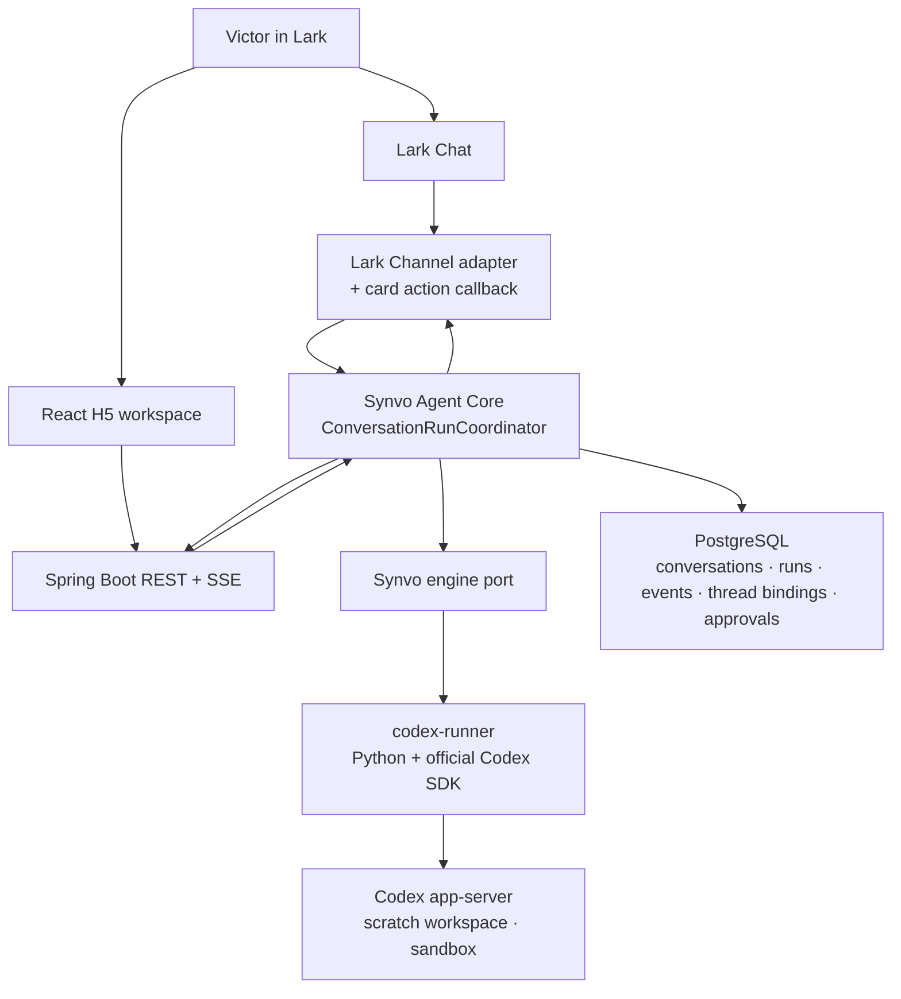

# Phase 3 — Codex in Lark

Status: **Draft**
Last updated: 2026-08-20

## Purpose

Phase 3 replaces the Phase 2 NVIDIA Nemotron model gateway entirely with the
OpenAI Codex agent engine, delivered through the Codex app-server and its
official Python SDK. The phase proves this vertical slice:

```text
Natural-language request in Lark Chat or H5
    → shared conversation boundary
    → Synvo engine port
    → codex-runner (Python SDK → Codex app-server)
    → one responsive, streaming, approval-aware conversation
```

The MVP name for this capability is **Codex in Lark**. Phase 3 delivers engine
parity plus the agency foundations (workspace, sandbox, safe tool visibility,
and a working approval round-trip). It does not deliver any Lark-facing agentic
workflow; that is Phase 4.

Every Phase 1, 2, and 2.5 identity, permission, encryption, deduplication,
lifecycle, and response-routing guarantee is preserved.

## Confirmed Decisions

| Area | Decision |
|---|---|
| Phase structure | Four sequential checkpoints: 3.0 Spike, 3.1 Engine Integration, 3.2 Agency Basics, 3.3 Approvals |
| Engine | OpenAI Codex; the Nemotron gateway, Spring AI dependency, and model configuration are removed in this phase |
| Engine transport | Codex app-server controlled by the official Python SDK (`openai-codex`), pinned versions |
| Runner | One Python sidecar service (`codex-runner`) in Docker Compose; no product logic inside it |
| Backend boundary | A Synvo-owned engine port; Codex, SDK, and runner details never cross it |
| Backend ↔ runner contract | HTTP commands plus a streamed event channel expressed in Synvo lifecycle vocabulary, idempotent by request ID |
| Orchestration | `ConversationRunCoordinator` and the shared conversation boundary remain the single entry point for both surfaces |
| Intent routing | `IntentRouter` is preserved; Codex serves `DIRECT_ANSWER`; clarification, research-unavailable, and meeting-unavailable responses remain deterministic |
| State ownership | PostgreSQL remains the source of truth for conversations, turns, runs, and events; Codex thread state is engine-internal |
| Thread continuity | A persisted conversation-to-Codex-thread binding; one Lark chat or H5 conversation resumes one Codex thread |
| Workspace | One dedicated, git-initialized scratch workspace volume; no enterprise content in Phase 3 |
| Sandbox | Read-only by default; `workspace-write` only via the approval flow; `danger-full-access` is forbidden |
| Approvals | Real Codex approval requests only; rendered as Lark card actions and H5 confirmation controls |
| User | Victor only, on Victor's personal Codex subscription; single-user is a hard constraint of this phase |
| Design-it-twice record | Python SDK sidecar chosen over a bespoke Java JSON-RPC client because the official SDK is TypeScript/Python only and absorbs the experimental app-server protocol; comparison recorded in the task notes |

## Objectives

1. Prove the Codex app-server, Python SDK, authentication, event stream, and
   approval callback ergonomics on the target machine before writing
   application code.
2. Introduce the `codex-runner` service and a Synvo-owned engine port with a
   contract in Synvo vocabulary.
3. Reach full conversation parity with the Phase 2 experience on both surfaces:
   one evolving response, stop, retry, reconnect, replay, timeout, restart
   recovery, and duplicate suppression.
4. Remove the Nemotron gateway, Spring AI dependency, and model configuration.
5. Give Codex a scoped workspace with a read-only default sandbox and surface
   real tool activity as safe `TOOL_RUNNING` labels.
6. Rework the turn lifecycle for long-running agent turns: a configurable
   engine turn timeout, a bounded approval wait, and safe terminal states for
   every path including runner death and usage-limit exhaustion.
7. Deliver one working approval round-trip through a Lark card action and the
   H5 confirmation UI.
8. Extend the architecture tests so engine containment is mechanically
   enforced.
9. Prove all behavior with automated, PostgreSQL, Docker, regression, and
   controlled live Lark verification.

## Architecture



The runner is a translation layer, not a second brain. It holds no
conversation policy, no Lark knowledge, and no product state. Codex thinks it
is talking to an editor client; Lark and H5 see the same Synvo lifecycle they
see today.

## Scope

### 3.0 Controlled Codex spike — gate

Prove the platform surface on the target machine before application code.

- Install and pin the Codex CLI and `openai-codex` SDK versions.
- Authenticate once on the host; verify `auth.json` can be mounted into a
  container as a secret and survives runner restarts.
- Start a thread, run a turn, and observe the full streamed event sequence.
- Confirm thread resume across app-server restarts.
- Trigger one real approval request (sandbox escalation) and answer it through
  the SDK; record the callback ergonomics and timeout behavior.
- Confirm interrupt/stop semantics mid-turn.
- Confirm how the Lark card action callback (`card.action.trigger`) is
  delivered with the existing WebSocket long connection and the installed SDK
  version.
- Record the verified API surface, versions, event names, and constraints in a
  focused technical reference under `docs/technical/`.

Gate: do not begin 3.1 until the spike items pass and the technical reference
exists. Spike code is throwaway; nothing from it ships.

### 3.1 Engine integration and conversation parity

- Add the `codex-runner` Compose service: Python, pinned Codex CLI and SDK,
  scratch workspace volume, secret-mounted authentication, health check.
- Define the Synvo engine port in the backend and route `DIRECT_ANSWER`
  generation through it; exact class names and placement follow the smallest
  coherent implementation, and the Phase 2.5 boundary behavior is
  authoritative.
- Runner API in Synvo vocabulary: submit turn, stop, approval decision, and a
  streamed lifecycle event channel; idempotent by request ID.
- Map engine events to the existing lifecycle: accepted, thinking, streaming,
  ordered content deltas, completed, failed. No SSE contract or REST payload
  changes.
- Persist a conversation-to-thread binding (first Flyway migration after V4)
  and resume the same Codex thread for consecutive turns.
- Remove the Nemotron gateway, Spring AI dependency, and model configuration;
  provide a disabled-engine mode so the ordinary stack runs credential-free.
- Preserve stop, retry-in-place, SSE replay, duplicate suppression, timeout,
  and restart recovery exactly as accepted in Phases 2 and 2.5.

### 3.2 Agency basics

- Scoped scratch workspace: git-initialized, empty of enterprise content,
  isolated per environment.
- Sandbox policy: read-only default; `workspace-write` reachable only through
  the approval flow; `danger-full-access` rejected by configuration.
- Surface real command and tool activity as `TOOL_RUNNING` lifecycle events
  with sanitized, content-free labels; raw commands, arguments, output, and
  file contents never reach the UI, SSE payloads, Lark cards, or logs.
- Long-turn lifecycle rework: a configurable engine turn timeout (distinct
  from the Phase 2 two-minute default), safe terminal handling for runner
  death mid-turn, and a safe terminal error when the subscription usage limit
  is exhausted.
- Runner supervision: health checks, restart behavior, and recovery of
  interrupted runs into exactly one safe terminal state.

### 3.3 Approvals

- Wire the Lark card action callback path end to end: subscription,
  deduplication, pilot-only validation, and routing to the owning run.
- Render a real Codex approval request as an actionable Lark card and as an
  H5 confirmation using the existing Phase 2.4 confirmation presentation
  contract, now with live approve and reject actions for engine approvals.
- Approve resumes the turn; reject terminates it safely; an unanswered
  approval hits a bounded wait and produces a safe terminal state; duplicate
  decisions are idempotent.
- Persist minimum approval state for idempotency and audit: request, safe
  label, decision, decider, and timestamps. No command text or content is
  persisted.
- Approvals in this phase gate only Codex workspace actions. No Lark write
  operation exists or is reachable.

Expected configuration names:

```text
SYNVO_ENGINE_ENABLED
SYNVO_ENGINE_RUNNER_BASE_URL
SYNVO_ENGINE_TURN_TIMEOUT
SYNVO_ENGINE_APPROVAL_TIMEOUT
```

The engine is disabled by default. Enabled configuration is validated at
startup and never logged.

## Deliverables

### 3.0 Spike

- [ ] Pinned CLI and SDK versions recorded.
- [ ] Auth, streaming, resume, approval, interrupt, and card-callback findings
      recorded in `docs/technical/phase-3-codex-app-server.md`.
- [ ] Gate review passed before 3.1 begins.

### 3.1 Engine integration

- [ ] `codex-runner` Compose service with health check and secret-mounted
      authentication.
- [ ] Synvo engine port; both surfaces reach Codex only through the shared
      conversation boundary.
- [ ] Runner contract with idempotent submission and Synvo-vocabulary events.
- [ ] Conversation-to-thread binding migration and resume behavior.
- [ ] Nemotron gateway, Spring AI dependency, and model configuration removed;
      disabled-engine mode works credential-free.
- [ ] Conversation parity on both surfaces with unchanged REST/SSE contracts.

### 3.2 Agency basics

- [ ] Scratch workspace and enforced sandbox policy.
- [ ] Sanitized `TOOL_RUNNING` activity on both surfaces.
- [ ] Engine turn timeout, approval wait bound, usage-limit terminal error,
      and runner-death recovery.

### 3.3 Approvals

- [ ] Lark card action callback path with dedup and pilot-only validation.
- [ ] Actionable approval card and H5 confirmation from one shared lifecycle
      event.
- [ ] Idempotent approve/reject/timeout semantics with audit state.

### Cross-cutting

- [ ] `ArchitectureBoundaryTests` extended: engine port containment; no Codex,
      SDK, or runner-protocol types outside the engine adapter.
- [ ] `docs/PRINCIPLES.md` checklist applied to the engine port and runner
      contract; design-it-twice comparison recorded in task notes.
- [ ] README, `.env.example`, and verification commands updated to match the
      implemented reality.

## Test Plan

### Backend unit and boundary tests

- [ ] Engine disabled by default; enabled configuration rejects missing or
      malformed values without exposing secrets.
- [ ] Both surfaces submit through the shared boundary; no adapter reaches the
      runner or engine directly.
- [ ] Engine events map to contiguous ordered lifecycle events with exactly
      one terminal state per run.
- [ ] Stop, retry-in-place, duplicate request IDs, timeout, approval timeout,
      and usage-limit failure each produce the specified safe outcome.
- [ ] Runner transport failure is classified as engine unavailability, not
      agent or delivery failure; delivery failure stays in the adapters.
- [ ] Architecture rules fail with actionable messages on engine containment
      violations.
- [ ] Tests use a fake engine port; no live Codex calls in the ordinary suite.

### Runner tests (Python)

- [ ] Contract tests for submit, stop, approval decision, idempotent replay,
      and event translation against a faked SDK client.
- [ ] Sandbox policy tests: read-only default, forbidden `danger-full-access`.
- [ ] Label sanitization tests: no command text, arguments, output, or file
      content in any emitted event.

### PostgreSQL integration tests

- [ ] Thread binding survives restart; consecutive turns resume one thread.
- [ ] Approval records enforce idempotency and carry no content.
- [ ] Phase 2 conversation, turn, run, event, replay, deletion-protection, and
      retention behavior is unchanged.

### Frontend tests

- [ ] Confirmation presentation renders live approve/reject actions for engine
      approvals and remains review-only for everything else.
- [ ] Approval resolution, timeout, and rejection reach the specified terminal
      presentation without duplicate turns.
- [ ] Existing conversation, stop, retry, reconnect, and deletion suites pass
      unchanged.

### Regression and stack tests

- [ ] Complete backend, frontend, and runner suites pass; package builds pass.
- [ ] Compose stack healthy with engine disabled and with engine enabled.
- [ ] Restart of backend and of runner each recover to safe state with
      persisted history intact.
- [ ] Count-only redacted log scan: zero credentials, prompts, message bodies,
      command text, or file content.

### Controlled live Lark smoke test

Manual, never in the automated suite:

- [ ] One Lark DM and one H5 prompt each produce one evolving Codex response
      with correct anchor behavior.
- [ ] A long response streams to completion; stop → retry works without
      duplicate turns.
- [ ] One real approval round-trip: approve resumes and completes; a second
      request rejected terminates safely.
- [ ] Backend and runner restarts preserve authorization, history, and thread
      continuity.
- [ ] Log inspection finds no sensitive values.

## Acceptance Criteria

Phase 3 is complete when:

1. The `codex-runner` starts with the Compose stack, authenticates, and
   reports healthy; the engine-disabled stack runs credential-free.
2. The backend reaches Codex only through the Synvo engine port, enforced by
   an architecture rule.
3. The Nemotron gateway, Spring AI dependency, and model configuration are
   removed, with a safe disabled-engine mode in their place.
4. A Lark DM from Victor produces exactly one evolving Codex response with
   correct normal/reply anchor behavior and duplicate-delivery suppression.
5. An H5 prompt streams ordered deltas into one assistant turn and reaches
   exactly one terminal state; REST and SSE contracts are unchanged.
6. Consecutive messages resume the same persisted Codex thread per
   conversation.
7. Stop, retry-in-place, replay, and duplicate request IDs behave exactly as
   accepted in Phase 2.5.
8. Long-turn timeout, approval timeout, usage-limit exhaustion, and
   backend-or-runner restart each produce exactly one safe terminal state.
9. Codex operates only in the scoped workspace under the read-only default
   sandbox; tool activity appears only as sanitized labels.
10. One real approval round-trip works end to end on both surfaces with
    idempotent decisions and bounded waits.
11. No Codex credential, Lark token, prompt, message body, command text, or
    file content appears in the repo, images, logs, browser storage, or
    responses.
12. The system remains one React application, one Spring Boot modular
    monolith, one PostgreSQL database, and one engine runner with no product
    logic.
13. All automated, PostgreSQL, Docker, regression, and controlled live Lark
    verification passes, or an explicit user-approved waiver is recorded in
    the Completion Audit.

## Explicit Non-Goals

Phase 3 does not include:

- Any Lark-facing tool, MCP server, or Permissioned Lark Action Gateway
  implementation.
- Enterprise Knowledge Research, configured-Drive retrieval, citations, or
  Meeting-to-Execution.
- Lark Tasks, Calendar, Base, Docs, or Drive writes of any kind.
- Enterprise content inside the Codex workspace.
- Multi-user access, group messages, or any use beyond Victor's personal
  subscription.
- `danger-full-access`, unattended auto-approval, or approval bypasses.
- A second engine, model selector, or Nemotron fallback path.
- Message brokers, vector databases, or additional services beyond the single
  runner.

## Implementation Sequence

1. Run and record the Phase 2.5 regression baseline.
2. Complete the 3.0 spike and its technical reference; pass the gate.
3. Add the runner service skeleton with health checks and pinned versions.
4. Introduce the engine port and route direct answers through a faked engine
   in tests, then the real runner.
5. Add the thread-binding migration and resume behavior.
6. Remove Nemotron and Spring AI; verify the disabled-engine stack.
7. Complete parity verification on both surfaces (3.1 gate).
8. Implement workspace, sandbox, sanitized activity, and long-turn lifecycle
   (3.2 gate).
9. Implement the card action callback path, approval UI, and approval
   semantics (3.3 gate).
10. Run complete regression, Docker, log-safety, and live Lark verification.
11. Record the Completion Audit.

Only one boundary moves at a time. The stack must remain runnable with the
engine disabled after every step.

## Risks and Controls

| Risk | Control |
|---|---|
| Experimental app-server protocol drifts | Official SDK pinned with its runtime; all protocol contact isolated in the runner |
| Card action callback surface is new | Proven in the 3.0 spike before any dependent design is fixed |
| Long agent turns break Phase 2 timeout assumptions | Dedicated engine turn timeout and approval wait, with characterization tests before rework |
| Prompt injection reaches an agent that can act | Read-only sandbox, approval gate, scoped empty workspace, pilot-only inputs, no Lark tools |
| Sensitive content leaks through activity or logs | Sanitized-label policy tested in the runner; count-only redacted log scans |
| Subscription usage limits interrupt turns | Explicit safe terminal error; verified in live smoke if encountered |
| Runner becomes a second application | No product logic in the runner; contract in Synvo vocabulary; architecture rule on the engine port |
| Auth credential mishandling | Secret-mounted `auth.json`, never in images, repo, or logs |

## Completion Audit

Status: **Pending — do not change the phase status to `Complete` until every
required gate has direct evidence or an explicit user-approved waiver recorded
here.**

## Primary References

- [Codex app-server](https://learn.chatgpt.com/docs/app-server)
- [Codex SDK (TypeScript and Python)](https://learn.chatgpt.com/docs/codex-sdk)
- [Codex non-interactive mode](https://learn.chatgpt.com/docs/non-interactive-mode)
- [`openai-codex` on PyPI](https://pypi.org/project/openai-codex/)
- [Lark OpenAPI Java SDK](https://github.com/larksuite/oapi-sdk-java)
- [Lark card interaction callbacks](https://open.larksuite.com/document/)

The Codex platform documentation changes quickly. The 3.0 spike verifies the
actual installed surface against current official documentation; this
specification defers to spike evidence on protocol details.
