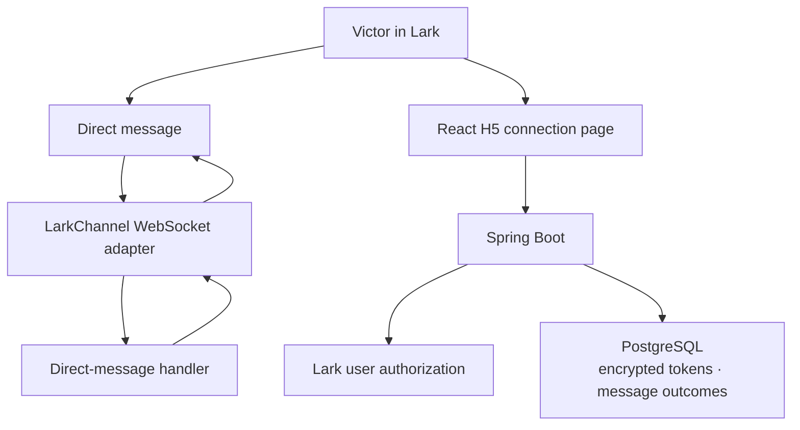

# Phase 1 — Lark-Native Connection

## Purpose

Phase 1 connects the Phase 0 foundation to the real Lark environment and proves
that Synvo can operate as a permission-aware, Lark-native application for one
pilot user.

The phase establishes two small vertical slices:

```text
Lark direct message → Spring Boot → deterministic bot reply

Lark H5 application → user authorization → encrypted token storage
```

This is a connection and identity phase, not an AI phase. It does not introduce
the Synvo Agent Core, NVIDIA Nemotron, knowledge retrieval, meeting workflows,
or model-generated responses.

## Confirmed Decisions

| Area | Decision |
|---|---|
| Pilot user | Victor only |
| Lark capabilities | Bot and Web App/H5 enabled in the same custom application |
| Conversation surface | Direct messages with the Synvo bot only |
| Group messages | Not supported or processed in Phase 1 |
| Event transport | Lark WebSocket/long connection |
| Event subscription | `im.message.receive_v1` |
| Backend integration | Official Lark OpenAPI Java SDK |
| Bot behavior | Deterministic acknowledgement only |
| UI direction | Synvo-owned, Beautiful UI-inspired AI-native visual language |
| Phase 1 UI scope | Polished connection states and design foundation; no AI workflow UI or Cards yet |
| H5 authorization | Real Lark user authorization |
| Token persistence | PostgreSQL, encrypted at rest |
| Local encryption | AES-256-GCM with a key supplied through the environment |
| Public hosting | No permanent public environment in Phase 1 |
| H5 live testing | Temporary HTTPS development URL when required |
| Agent and model | Explicitly deferred to Phase 2 |

## Recommendation on the Public URL

A permanent public URL is not needed yet.

The WebSocket bot connection only requires outbound internet access, so local
development can receive direct-message events without a webhook, public IP, or
public callback URL.

The H5 application is different: Lark must be able to open the frontend through
an HTTPS URL. For the Phase 1 live H5 test, use a temporary development tunnel
that forwards to the existing frontend entry point. Keep the tunnel outside
Docker Compose and do not make a tunnel provider a production dependency.

This gives the project a real Lark H5 and authorization test without forcing an
early decision about cloud hosting, DNS, certificates, or production topology.
A stable development subdomain can be added later if changing the temporary URL
becomes a recurring inconvenience. Production hosting belongs to the launch
hardening phase.

## Objectives

1. Add the official Lark OpenAPI Java SDK and verify that its released channel
   APIs work with Java 21 and the current Spring Boot application.
2. Start and stop one Lark WebSocket connection with the Spring Boot lifecycle.
3. Receive normalized Lark message events without exposing a webhook endpoint.
4. Accept messages only when they are direct messages from Victor.
5. Reply once with a deterministic acknowledgement linked to the originating
   direct message.
6. Persist enough message metadata to reject duplicate deliveries and record the
   outcome without storing full conversation content.
7. Authenticate Victor in the H5 application using Lark's user authorization
   flow.
8. Exchange authorization codes and refresh user tokens only in the backend.
9. Encrypt access and refresh tokens before writing them to PostgreSQL.
10. Keep tokens, the app secret, and encryption material out of the browser,
    logs, source code, and container images.
11. Establish a polished, responsive light/dark visual foundation for the React
    H5 application using a small set of Synvo-owned design tokens.
12. Show an authenticated connection-status experience with intentional loading,
    ready, unauthorized, and error states.
13. Prove the complete behavior with automated tests and a focused live Lark
    smoke test.

## Phase 1 Architecture



The Lark channel remains an I/O boundary. It normalizes incoming messages and
sends replies; it does not contain agent logic or decide future workflows.

## AI-Native UI Direction

The Bot and H5 application are two surfaces of one product, but they have
different visual capabilities:

- Lark Cards must use Lark's supported Card Kit schema and components. They can
  be polished and consistent, but they cannot reproduce arbitrary React,
  Tailwind, animation, or layout behavior.
- The React H5 application has full control over layout, responsive behavior,
  theme, motion, and complex interactions.

Use [Beautiful UI](https://www.beautifului.dev/) as an interaction-pattern and
quality reference. Implement Synvo-owned components and visual tokens rather
than importing its complete component catalog or reproducing its demo product
wholesale.

The phased rollout is:

| Phase | AI-native UI behavior |
|---|---|
| Phase 1 | Connection screen, loading and error states, semantic status chips, responsive light/dark theme |
| Phase 2 | Streaming answers, prompt composer, high-level activity display, tool chips, follow-up prompts |
| Phase 3 | Source/context cards, research progress, citations, insights, search and comparison views |
| Phase 4 | Approval cards, task rows, recommendations, editable diffs and selection actions |

Never expose raw model chain-of-thought. Future "Thinking" UI must show concise,
verifiable activity such as searching sources, reading documents, running a
named tool, or preparing a cited response.

## Deliverables

### 1. Lark SDK and configuration

- [ ] Confirm that Bot and Web App/H5 capabilities are enabled in the same Lark
      custom application.
- [ ] Configure event delivery as WebSocket/long connection.
- [ ] Subscribe to `im.message.receive_v1` and no additional event solely for
      hypothetical future behavior.
- [ ] Do not configure a webhook event URL in Phase 1.
- [ ] Add one verified stable release of `com.larksuite.oapi:oapi-sdk`.
- [ ] Confirm that the released artifact contains the planned `LarkChannel`
      WebSocket API before building application code around it.
- [ ] If the documented high-level channel API is not in a stable published
      artifact, use the official SDK's `WSClient` and `Client` directly rather
      than adding another language runtime or an unofficial SDK.
- [ ] Record the selected SDK version in `pom.xml`; do not use a dynamic version.
- [ ] Extend typed Lark configuration with the minimum Phase 1 settings:
      transport, pilot open ID, and authorization settings.
- [ ] Keep Lark disabled by default so the ordinary local stack and automated
      tests do not require real credentials.
- [ ] Fail startup clearly when Lark is enabled but a required value is absent.
- [ ] Never include configured secret values in validation errors or logs.

Expected configuration names may include:

```text
SYNVO_LARK_ENABLED
SYNVO_LARK_APP_ID
SYNVO_LARK_APP_SECRET
SYNVO_LARK_TRANSPORT=websocket
SYNVO_LARK_PILOT_OPEN_ID
SYNVO_LARK_H5_BASE_URL
SYNVO_TOKEN_ENCRYPTION_KEY
```

The bot and H5 capabilities belong to the same Lark custom application, so they
reuse the existing application ID and secret. Do not introduce duplicate Lark
credentials.

### 2. WebSocket lifecycle

- [ ] Create the Lark channel only when `synvo.lark.enabled=true`.
- [ ] Connect after the Spring application is ready rather than during property
      construction or static initialization.
- [ ] Disconnect gracefully during Spring Boot shutdown.
- [ ] Surface a small connection state: disabled, connecting, connected,
      reconnecting, or failed.
- [ ] Expose only a safe connection summary through application status or a
      focused authenticated endpoint.
- [ ] Log connection state transitions and Lark request IDs where available,
      without logging credentials or message contents.
- [ ] Do not add Redis, a message broker, or a second worker service for the
      WebSocket connection.

### 3. Direct-message handling

- [ ] Subscribe only to the message event required for the bot interaction.
- [ ] Reject or ignore every event whose chat type is not direct/p2p.
- [ ] Accept messages only when the sender open ID matches the configured Victor
      pilot open ID.
- [ ] Ignore messages generated by the bot itself.
- [ ] Initially support text direct messages only.
- [ ] Return a short deterministic response such as:

```text
Synvo is connected and ready. AI conversations and workflows will be enabled in
the next phase.
```

- [ ] Reply to the originating message rather than creating an unrelated chat
      message.
- [ ] Do not echo the user's entire message into logs, database records, or the
      acknowledgement.
- [ ] Return a clear deterministic unsupported-content response for a direct
      message containing only media or another unsupported type.
- [ ] Keep the direct-message handler independent of the future Agent Core.

Group-message scopes may already exist on the Lark custom application, but
Phase 1 must not process or respond to group conversations. If Lark delivers a
group event through the same message-event subscription because of existing app
scopes, the direct-message boundary rejects it before business processing.

### 4. Message deduplication and audit

- [ ] Add the first Flyway database migration now that the project has real
      persistent domain state.
- [ ] Persist the Lark message ID under a unique constraint before producing a
      reply.
- [ ] Record only the minimum operational metadata: message ID, sender open ID,
      chat type, received time, processing outcome, reply message ID when
      available, and a safe error code.
- [ ] Do not store the full message body in Phase 1.
- [ ] Treat a repeated event with the same message ID as already handled.
- [ ] Ensure one application processing attempt is active for a message at a
      time.
- [ ] Make failure state observable and retryable without silently creating
      multiple replies.
- [ ] Define a simple retention period for message-processing records; do not
      build a general audit platform.

The SDK's in-memory event safety features may provide an additional guard, but
PostgreSQL remains the application-owned deduplication boundary so behavior does
not depend only on one process's memory.

### 5. H5 user authorization

- [ ] Add a small frontend adapter around the official Lark H5 authorization
      API so browser-specific calls do not spread through React components.
- [ ] Obtain a short-lived Lark authorization code in the H5 client.
- [ ] Send the authorization code to a same-origin Spring Boot endpoint.
- [ ] Exchange the code for user tokens in the backend.
- [ ] Retrieve the authenticated Lark identity and require it to match Victor's
      configured pilot open ID.
- [ ] Refuse authorization for every other Lark user and do not persist their
      tokens.
- [ ] Create a backend-owned session using a Secure, HttpOnly cookie.
- [ ] Do not return access tokens or refresh tokens to React.
- [ ] Protect authorization and session endpoints against code replay, CSRF, and
      open redirects.
- [ ] Provide only these minimum H5 API behaviors:
      establish authorization, read current connection status, and sign out.

Prefer Lark's in-client authorization-code flow for the H5 application. Avoid a
second username/password login and avoid introducing a separate identity
provider in the MVP.

### 6. Encrypted user-token storage

- [ ] Add a narrow token-encryption boundary with an AES-256-GCM implementation.
- [ ] Supply the encryption key as a Base64-encoded 256-bit environment secret.
- [ ] Use a fresh random nonce for every encrypted value.
- [ ] Bind ciphertext to the Lark tenant, user, and token type as authenticated
      context where practical.
- [ ] Store access token, refresh token, expiry timestamps, and the minimum user
      identity required for later Lark calls.
- [ ] Never store plaintext tokens or the encryption key in PostgreSQL.
- [ ] Refresh an access token on demand before it expires using a small safety
      window.
- [ ] Persist the newly returned refresh token when Lark rotates it.
- [ ] Mark the connection as requiring reauthorization when refresh fails with a
      terminal authorization error.
- [ ] Do not add scheduled background token refresh when Phase 1 has no
      background workflow requiring it.
- [ ] Keep future managed-KMS replacement localized to the encryption boundary;
      do not add a cloud SDK until a hosting provider is selected.

### 7. React H5 connection page

- [ ] Replace the Phase 0 connectivity proof with a small Lark-aware connection
      page while preserving backend ready/error feedback.
- [ ] Define a small Phase 1 token set in the existing Tailwind configuration:
      color, typography, spacing, radius, shadow, and motion.
- [ ] Build Synvo-owned UI primitives only for current connection-page needs;
      do not add a general component library.
- [ ] Provide intentional loading, unauthorized, connected, reconnecting, and
      error presentations rather than raw diagnostic text.
- [ ] Use compact semantic status chips for bot connection and user authorization.
- [ ] Support light and dark appearance and remain legible inside Lark on desktop
      and mobile-sized viewports.
- [ ] Respect reduced-motion preferences and maintain keyboard-visible focus and
      accessible contrast.
- [ ] Show whether the page is running inside the expected Lark environment.
- [ ] Start authorization when no valid Synvo session exists.
- [ ] Show Victor's safe display identity after successful authorization.
- [ ] Show bot WebSocket status and user authorization status as separate facts.
- [ ] Provide retry behavior for a failed authorization exchange.
- [ ] Provide a sign-out action that clears the Synvo session without attempting
      to revoke unrelated Lark permissions.
- [ ] Do not add application routing, global state management, dashboards,
      research views, or meeting-plan views in this phase.
- [ ] Do not place tokens in local storage, session storage, URLs, client logs,
      or frontend state.

### 8. Development HTTPS access

- [ ] Document one verified method for exposing the existing frontend entry point
      through a temporary HTTPS development URL.
- [ ] Configure the temporary URL manually in the Lark custom application's H5
      settings for the live test.
- [ ] Keep frontend and `/api` traffic on one origin using the existing proxy
      arrangement.
- [ ] Do not place tunnel credentials in the repository or Compose configuration.
- [ ] Do not run the tunnel as a required application service.
- [ ] Keep Docker Compose fully usable when no tunnel is running.
- [ ] Revisit a stable domain only when repeated testing or deployment makes it
      valuable.

### 9. Documentation

- [ ] Add a Phase 1 setup section to `README.md` covering Lark developer-console
      settings, required event subscription, environment variables, startup,
      H5 test access, and shutdown.
- [ ] Explain how Victor's open ID is obtained and configured without adding a
      temporary allow-all mode.
- [ ] Document the live-test steps without including real IDs, secrets, tokens,
      or temporary tunnel URLs.
- [ ] Update the verification section in `AGENTS.md` only when new proven commands
      are required.
- [ ] Keep `docs/project-overview.md` unchanged unless implementation reveals an
      approved change to the product or architecture.

## Expected Backend Boundaries

Add packages only as their Phase 1 behavior is implemented. A small structure is
sufficient:

```text
backend/src/main/java/synvo/
├── api/
├── configuration/
├── lark/
│   ├── channel/
│   └── auth/
└── persistence/
```

- `lark/channel` owns WebSocket lifecycle, message normalization, filtering, and
  replies.
- `lark/auth` owns the user authorization exchange and token lifecycle.
- `persistence` contains the small JDBC repositories required for Phase 1 state.

Do not create `agent`, `research`, or `meeting` packages in Phase 1.

## Test Plan

### Backend unit tests

- [ ] Disabled Lark configuration starts without credentials or network access.
- [ ] Enabled Lark configuration rejects a missing app ID, app secret, pilot open
      ID, or encryption key without exposing values.
- [ ] A direct text message from Victor is accepted.
- [ ] A direct message from another user is ignored or rejected without a reply.
- [ ] A group message from Victor or any other user is ignored without a reply.
- [ ] A bot-generated message is ignored.
- [ ] A supported message produces the exact deterministic reply contract.
- [ ] An unsupported direct-message content type receives the expected safe
      deterministic response.
- [ ] A duplicate message ID does not trigger a second application reply.
- [ ] Channel connect, reconnect, error, and shutdown states are represented
      correctly using a fake SDK boundary.
- [ ] Tests make no live Lark network calls.

### Authorization and encryption tests

- [ ] A valid authorization code for Victor creates or updates one user
      connection and establishes a Synvo session.
- [ ] An authorization result for a non-pilot user is rejected and not stored.
- [ ] An invalid, expired, or replayed code fails safely.
- [ ] Stored access and refresh token values do not contain their plaintext input.
- [ ] Encrypting the same token twice produces different ciphertext.
- [ ] A modified ciphertext, nonce, or authenticated context fails decryption.
- [ ] A token inside the refresh window is refreshed before use.
- [ ] Rotated access and refresh tokens replace the prior encrypted values.
- [ ] A terminal refresh failure changes the connection to reauthorization
      required.
- [ ] Logs and HTTP responses contain no token values.

### PostgreSQL integration tests

- [ ] Flyway creates the Phase 1 schema against a PostgreSQL Testcontainer.
- [ ] The message ID uniqueness constraint prevents duplicate processing records.
- [ ] The pilot user connection can be created and updated without creating
      duplicate identity records.
- [ ] Encrypted token fields survive a real database round trip and decrypt only
      with the configured test key.
- [ ] Repository tests use PostgreSQL rather than an in-memory substitute.

### Frontend tests

- [ ] The connection page renders loading, unauthorized, connected, and error
      states.
- [ ] Connection and authorization status chips expose understandable text, not
      color alone.
- [ ] Light and dark appearances retain readable content and visible focus
      states.
- [ ] Reduced-motion preference disables nonessential animation.
- [ ] The connection page remains usable at representative mobile and desktop
      widths.
- [ ] The Lark H5 authorization adapter is replaceable with a test fake.
- [ ] A successful authorization code exchange refreshes the connection state.
- [ ] A failed exchange offers a safe retry.
- [ ] The page never writes tokens to browser storage.
- [ ] The existing frontend test, typecheck, lint, and production build commands
      pass.

### Local stack regression tests

- [ ] With Lark disabled, `docker compose up --detach --wait` remains healthy
      without credentials or a tunnel.
- [ ] The frontend still reaches the backend through `/api`.
- [ ] The backend still proves PostgreSQL connectivity.
- [ ] All Phase 0 automated and Compose smoke tests continue to pass.

### Live Lark smoke test

This is a controlled manual test using real Lark credentials. It must not run in
the ordinary automated test suite.

- [ ] Enable the bot capability and direct-message event subscription in the
      Lark developer console.
- [ ] Configure Victor's pilot open ID and the required secrets locally.
- [ ] Start PostgreSQL, the backend, the frontend, and the WebSocket connection.
- [ ] Send one text direct message from Victor and receive one deterministic
      reply attached to that message.
- [ ] Verify a repeated delivery or replay fixture does not create a second
      application reply.
- [ ] Verify a direct message from a non-pilot account receives no Synvo reply.
- [ ] Verify a group message receives no Synvo reply.
- [ ] Expose the frontend temporarily through HTTPS and configure it as the Lark
      H5 application URL.
- [ ] Open the H5 application inside Lark and complete authorization as Victor.
- [ ] Confirm the page shows both bot connection and Victor authorization state.
- [ ] Restart the backend and confirm the encrypted user connection remains
      readable.
- [ ] Exercise token refresh with a controlled near-expiry fixture or safe test
      method.
- [ ] Inspect application and container logs for accidental credentials, tokens,
      or message bodies.
- [ ] Shut down the tunnel and confirm the ordinary Compose stack remains usable.

## Acceptance Criteria

Phase 1 is complete when all of the following are true:

1. The Spring Boot application can establish and gracefully close a real Lark
   WebSocket connection.
2. A direct text message from Victor receives exactly one deterministic Synvo
   acknowledgement.
3. Non-pilot users and all group messages receive no Synvo response.
4. Duplicate deliveries do not cause a second application processing attempt or
   reply.
5. Victor can open the React H5 application in Lark and establish a backend
   session using Lark user authorization.
6. Access and refresh tokens are encrypted before entering PostgreSQL and never
   reach the browser or application logs.
7. Expiring user tokens can be refreshed and rotated safely on demand.
8. The bot connection and user authorization state are visible without exposing
   sensitive details.
9. The complete local stack still runs with Lark disabled and requires no
   external credentials for ordinary development.
10. Backend, frontend, PostgreSQL integration, Compose regression, and controlled
    live Lark tests pass.
11. No model, Agent Core, Drive retrieval, meeting workflow, group conversation,
    card interaction, or webhook behavior has entered the implementation.

## Explicit Non-Goals

Phase 1 does not implement:

- Group messages, group mentions, or ambient group monitoring
- Lark Cards or card-action callbacks
- The complete Beautiful UI component catalog or a generic design system package
- Streaming, tool, source, insight, approval, task, diff, or recommendation UI
- Webhook event delivery
- A permanent public environment or production domain
- Cloud deployment, managed KMS, or cloud secret-manager integration
- NVIDIA Nemotron or any other model call
- Spring AI or Spring AI Alibaba
- The Synvo Agent Core
- Natural-language intent routing
- Conversation memory or general AI chat
- Enterprise Knowledge Research
- Configured Drive-folder retrieval
- Meeting-to-Execution
- Tasks, Calendar, Base, Docs, or Drive writes
- Media download, parsing, or multimodal messages
- Multiple users, tenants, or administrator controls
- Background schedulers, Redis, message brokers, microservices, or Kubernetes

## Implementation Sequence

1. **SDK compatibility proof** — select a stable official Java SDK release and
   prove the WebSocket channel can connect and disconnect under Java 21.
2. **Configuration and lifecycle** — add validated properties, conditional
   startup, connection state, safe logging, and graceful shutdown.
3. **Persistent security foundation** — add Flyway, message-processing state,
   user-token storage, and AES-256-GCM encryption.
4. **Direct-message slice** — normalize, filter, deduplicate, acknowledge, and
   audit Victor's text direct messages.
5. **H5 authorization backend** — exchange codes, verify Victor, persist encrypted
   tokens, refresh on demand, and establish the backend session.
6. **H5 connection page** — establish the bounded AI-native visual foundation,
   integrate the Lark client authorization adapter, and display safe connection
   state.
7. **Automated verification** — complete unit, PostgreSQL integration, frontend,
   and Compose regression tests.
8. **Live Lark verification** — use real bot credentials and a temporary HTTPS
   URL to prove the direct-message and H5 flows end to end.
9. **Documentation** — record only the setup and commands that were actually
   verified.

Each step should keep the stack runnable with Lark disabled. The live Lark
profile is an additional capability, not a new requirement for every developer
startup.

## Definition of Done

- [ ] Every acceptance criterion is satisfied.
- [ ] All automated tests and the controlled live Lark smoke test pass.
- [ ] No real credentials, IDs, tokens, encryption keys, or tunnel URLs are
      committed.
- [ ] Direct-message processing remains deterministic and Victor-only.
- [ ] The React client has no access to Lark user tokens.
- [ ] PostgreSQL contains no plaintext token or message-content values.
- [ ] The codebase remains one React application, one Spring Boot modular
      monolith, and one PostgreSQL database.
- [ ] No Phase 2 Agent Core or model work has been pulled into Phase 1.

## Primary References

- [Lark Java SDK — Channel guide](https://github.com/larksuite/oapi-sdk-java/blob/v2_main/CHANNEL.md)
- [Lark H5 web application introduction](https://open.larksuite.com/document/client-docs/h5/introduction)
- [Lark OpenAPI Java SDK](https://github.com/larksuite/oapi-sdk-java)
- [Beautiful UI — AI-native interface patterns](https://www.beautifului.dev/)

The Lark SDK and platform documentation can change. During implementation,
verify the selected stable artifact and active authorization API against the
current official documentation rather than relying on copied examples.
